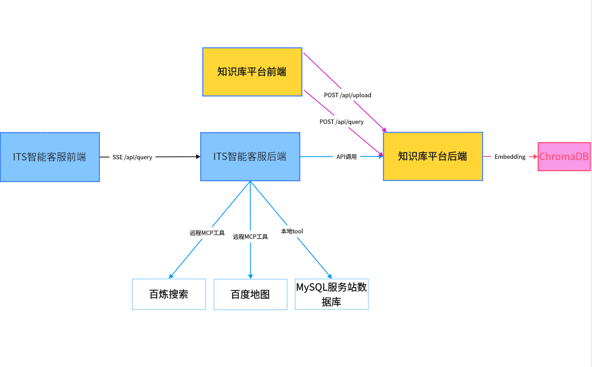
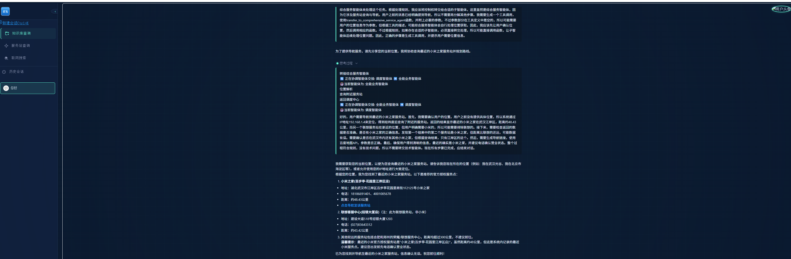
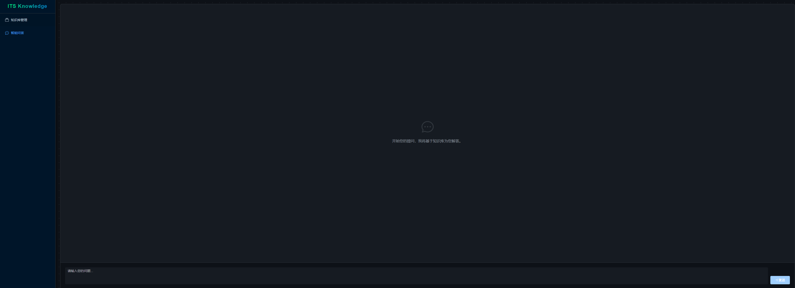

# ITS 智能客服与知识库平台 —— 全栈技术架构

**主题**：技术栈和ITS项目说明

**时长**: 1节课

 **讲师**：胡中奎

 **版本**：v1.0 

##  1、概览

本项目主要围绕 **ITS（Intelligent Technical Service）智能客服系统** 与 **ITS 知识库平台** 两大核心项目展开，涵盖 **两个前端 + 两个后端** 的完整技术栈，构建从需求分析 → 架构设计 → 编码实现 → 全链路能力。

| 项目                 | 类型             | 核心价值                                                     |
| -------------------- | ---------------- | ------------------------------------------------------------ |
| **ITS 智能客服系统** | 多智能体对话系统 | 实现“调度-技术-业务”三层智能体协作，支持服务站导航、技术问答等复杂场景 |
| **ITS 知识库平台**   | RAG 文档问答系统 | 支持私域知识上传、向量化存储、语义检索与生成式问答           |

**四大项目联动关系**

**ITS智能客服效果如下：**

**知识库平台效果如下：**

## 2、ITS 智能客服（多智能体架构）

### 1.1 技术栈全景

| 层级             | 技术选型                               | 说明                           |
| ---------------- | -------------------------------------- | ------------------------------ |
| **语言**         | Python 3.x                             | 主力开发语言                   |
| **Web 框架**     | FastAPI                                | 高性能异步框架                 |
| **服务器**       | Uvicorn                                | 高性能web 服务器               |
| **智能体框架**   | `openai-agents`（基于 Swarm 模式）     | 轻量级多 Agent 编排            |
| **LLM 接入**     | OpenAI SDK（兼容阿里百炼等）           | 统一接口，模型可替换           |
| **外部工具协议** | **MCP (Model Context Protocol)**       | 标准化连接地图、搜索等外部服务 |
| **数据库**       | MySQL + `pymysql` + `dbutils.PooledDB` | 连接池保障高并发稳定性         |
| **数据验证**     | `pydantic`                             | 运行时类型检查与序列化         |
| **HTTP 客户端**  | `httpx`（异步）、`requests`（同步）    | 外部 API 调用                  |
| **日志**         | Python `logging`                       | 结构化日志输出                 |

### 1.2 分层架构设计

系统代码组织在 `backend/app` 下，主要分为以下几层：

1. Presentation Layer (表现层)

  \-  **位置**: `presentation/`

  \-  **职责**: 处理 HTTP 请求与响应，定义 API 路由和数据模型 (Schemas)。

  \-  **关键组件**: `routes.py` (定义 `/api/query` 等接口), `schemas.py` (Pydantic 模型).

  \-  **交互**: 接收前端请求，调用 Application 层逻辑，并通过 SSE (Server-Sent Events) 流式返回结果。

2. Application Layer (应用层)

  \-  **位置**: `application/`

  \-  **职责**: 编排业务流程，管理会话状态，处理智能体执行流。

  \-  **关键组件**:

​    \-  `agent_service.py`: 核心业务入口，负责初始化对话上下文，启动智能体运行器 (Runner)。

​    \-  `session_manager.py`: 管理用户会话历史和上下文记忆。

​    \-  `stream_processor.py`: 处理智能体输出的事件流，将其转换为前端可消费的格式。

3. Core Agents Layer (核心智能体层)

  \- **位置**: `core_agents/`

  \-  **职责**: 定义具体的智能体角色、提示词 (Prompts) 和工具集 (Tools)。

  \-  **关键组件**:

​    \-  `orchestrator.py`: 调度智能体，作为总控入口，负责意图识别和任务分发。

​    \-  `technical_agent.py`: 技术顾问智能体，专注于解答技术维修类问题，拥有知识库查询能力。

​    \-  `comprehensive_service_agent.py`: 全能业务智能体，专注于服务站查询、导航等业务办理。

  \-  设计模式: 采用 Handoff (交接) 模式。调度器根据用户意图将控制权移交给专业智能体，专业智能体完成任务后将结果交还 (Return) 给调度器。

4. Infrastructure Layer (基础设施层)

  \-  **位置**: `infrastructure/`

  \-  **职责**: 提供底层技术支持，与外部系统交互。

  \-  **关键组件**:

​    \-  `database.py`: 数据库连接池封装。

​    \-  `mcp/`: MCP 客户端实现，负责连接和管理 MCP 服务器（如地图服务、搜索服务）。

​    \-  `tools/`: 具体的工具函数实现（如 SQL 查询、HTTP 请求、坐标转换等）。

​    \-  `logger.py`: 统一的日志配置。

### 1.3 关键工作流

1. 请求处理流:

  前端发送请求 -> `routes.py` 接收 -> `AgentService` 初始化上下文 -> `SessionManager` 加载历史 -> 启动 `Runner`。

2. 智能体编排流:

  `Orchestrator` 分析意图 -> (Handoff) -> `TechnicalAgent` / `ComprehensiveAgent` -> 执行工具 (Tools/MCP) -> 返回结果 -> `Orchestrator` 汇总 -> 输出给用户。

3. 流式响应流:

  智能体产生的每个 Token 或事件 (Event) -> `stream_processor.py` 捕获并格式化 -> SSE 响应 -> 前端实时渲染。

### 1.4 关键设计

- 模块化提示词管理: 提示词 (Prompts) 从代码中剥离，存储在 `prompts/` 目录，便于非技术人员维护和迭代。

- 连接池管理: 使用 `PooledDB` 管理数据库连接，避免频繁创建/销毁连接带来的开销。

- MCP 扩展性: 通过 MCP 协议集成外部工具，使得系统可以轻松扩展新的能力（如接入新的搜索源或 API）而不破坏核心逻辑。

##  3、ITS 智能客服前端（Vue 3 ）

### 3.1 技术栈全景

| 类别              | 技术                             | 作用                                 |
| ----------------- | -------------------------------- | ------------------------------------ |
| **框架**          | Vue 3 (Composition API)          | 组件化开发，逻辑复用                 |
| **构建工具**      | Vite                             | 极速冷启动 + HMR                     |
| **UI 库**         | Element Plus                     | 企业级组件（Input, Button, Loading） |
| **Markdown 渲染** | `marked` + `github-markdown.css` | 实时渲染 AI 返回的富文本             |
| **通信**          | `fetch` + `ReadableStream`       | 处理 SSE 流式响应                    |

------

### 3.2 分层架构设计

系统代码组织在 `front/its_front`，遵循标准的 Vue + Vite 项目结构：

\-  `src/`: 源代码目录

  \-  `assets/`: 静态资源（图片、样式文件）。

  \-  `App.vue`: 应用的根组件，通常包含主要的布局和对话窗口逻辑。

  \-  `main.js`: 入口文件，负责初始化 Vue 应用、引入 Element Plus 和全局样式。

  \-  `style.css`: 全局样式定义。

### 3.3 关键工作流

前端主要负责与后端 `AgentService` 进行实时交互，核心流程如下：

1. 消息发送:

  \-  用户在输入框输入问题。

  \-  前端通过 `fetch` 或 `axios` (或其他 HTTP 客户端) 向后端 `/api/query` 接口发送 POST 请求。

  \-  请求体包含：`query` (用户问题), `context` (包含 sessionId, userId 等上下文信息)。

2. 流式接收 (Server-Sent Events):

  \-  由于智能体生成回答需要时间，且需要打字机效果，后端采用流式响应。

  \-  前端利用 `fetch` API 的 `ReadableStream` 或 `EventSource` 监听响应流。

  \-  增量渲染: 每接收到一个数据块 (Chunk)，立即追加到当前对话气泡的消息内容中，并调用 `marked.parse()` 实时更新 HTML。

3. 状态管理:

  \-  虽然项目规模较小可能未引入 Pinia/Vuex，但组件内部利用 Vue 3 的 `ref` 和 `reactive` 管理以下状态：

​    \-  `messages`: 消息列表数组 (用户提问 + AI 回答)。

​    \-  `isLoading`: 加载状态，用于显示 Loading 动画或禁用输入框。

​    \-  `inputText`: 输入框当前内容。

### 3.4 关键设计

- Chat UI 布局：消息列表 + 输入框
- 实时打字机效果
- Markdown 支持：代码块、列表、加粗等自动高亮
- Loading 状态：禁用输入框 + 动画提示

## 4、ITS 知识库平台（RAG 架构）

### 4.1 技术栈全景

| 类别               | 技术                                        | 说明                           |
| ------------------ | ------------------------------------------- | ------------------------------ |
| **框架**           | FastAPI + Uvicorn                           | 同智能客服后端                 |
| **RAG 编排**       | LangChain                                   | 文档加载 → 切分 → 检索 → 生成  |
| **向量数据库**     | ChromaDB                                    | 本地持久化，轻量级             |
| **Embedding 模型** | OpenAI text-embedding-ada-002（或兼容模型） | 文本向量化                     |
| **LLM**            | OpenAI GPT / 通义千问（兼容 OpenAI API）    | 生成答案                       |
| **文档处理**       | `unstructured`, `markdownify`, `jieba`      | PDF/HTML → Markdown → 中文分词 |
| **配置管理**       | `pydantic-settings` + `.env`                | 环境变量驱动                   |

### 4.2 分层架构设计

系统代码组织在 `backend/knowlege` 下，主要分为以下几层：

1. Presentation Layer (表现层)

  \-  位置: `presentation/api/`

  \-  职责: 暴露 RESTful API 接口，处理 HTTP 请求参数验证和响应格式化。

  \-  关键组件:

​    \-  `routes.py`: 定义 `/upload` (文件上传) 和 `/query` (问答) 接口。

​    \-  `schemas.py`: 定义请求和响应的数据模型 (Pydantic Models)。

2. Business Logic Layer (业务逻辑层)

  \-  位置: `business_logic`

  \-  职责: 核心 RAG 流程的编排与实现。

  \-  关键组件:

​    \-  `file_processor.py`: 文档处理服务。负责接收上传的文件，进行清洗、HTML 转 Markdown、文本切分 (Splitting)。

​    \-  `retrieval_service.py`: 检索服务。负责将用户问题转化为向量，在 ChromaDB 中检索最相关的文档片段 (Chunks)。

​    \-  `query_service.py`: 生成服务。负责构建 Prompt（包含检索到的上下文），调用 LLM 生成最终答案。

​    \-  `document_service.py`: 文档管理逻辑。

3. Data Access Layer (数据访问层)

  \-  位置: `data_access/`

  \-  职责: 封装与向量数据库 ChromaDB 的交互细节。

  \- 功能: 文档向量化存储 (Upsert)、相似度搜索 (Similarity Search)。

4. Infrastructure & Utils (基础设施与工具)

  \-  位置: `chroma_kb/`, `utils/`, `config/`

  \-  职责:

​    \-  `chroma_kb/`: 持久化存储 ChromaDB 的 SQLite 数据文件和索引。

​    \-  `utils/text_utils.py`: 提供文本清洗、正则替换等通用工具函数。

​    \-  `config/`: 管理应用配置和环境变量加载。

### 4.3 关键工作流

**知识入库流程 (Upload )**

1. 上传: 用户通过 `/upload` 接口上传文件 (如 HTML, PDF)。

2. 预处理: `FileProcessor` 调用 `TextUtils` 清洗文本，将 HTML 转换为 Markdown。

3. 切分: 使用 LangChain 的 Splitter 将长文档切分为较小的 Chunks。

4. 向量化与存储: 调用 Embedding 模型将 Chunks 转换为向量，并存入 `ChromaDB` (`data_access` 层)。

**知识问答流程 (Retrieval )**

1. 提问: 用户通过 `/query` 接口发送问题。

2. 检索: `RetrievalService` 将问题向量化，在 `ChromaDB` 中查找 Top-K 相关文档片段。

3. 生成: `QueryService` 将“系统指令 + 检索到的上下文 + 用户问题”组装成 Prompt。

4. 回答: 调用 LLM 生成回答，并返回给用户。

### 4.4 关键设计

\-	本地化向量存储:	使用 ChromaDB 本地持久化，无需依赖外部复杂的向量数据库服务，部署轻量。

\-	格式标准化:	 统一将多源文档转换为 Markdown 格式处理，保留了文档的结构信息（标题、列表），有助于提升 LLM 的理解能力。

 \-	模块化:	 RAG将检索 (Retrieval) 和生成 (Generation) 解耦，便于独立优化（例如更换检索算法或更换 LLM 模型）。

##  5、知识库平台前端（Vue 3）

### 4.1 技术栈全景

| 技术                     | 作用                           |
| ------------------------ | ------------------------------ |
| Vue 3 + `<script setup>` | 组合式 API 开发                |
| Vite                     | 构建工具                       |
| Vue Router 4             | 路由管理（/knowledge ↔ /chat） |
| Element Plus             | Upload、Table、Card 等组件     |
| Axios                    | HTTP 请求封装（带拦截器）      |
| marked                   | Markdown 渲染                  |

### 4.2 分层架构设计

项目遵循标准的 Vue 3 + Vite 工程结构，位于 `front/its_knowlege_platform`：

\-  `src/api/`: API 接口封装。

  \-  `request.js`: Axios 实例配置，包含 baseURL (`/api`) 和响应拦截器。

  \-  `knowledge.js`: 定义具体业务接口（如 `uploadFile`）。

\-  `src/assets/`: 静态资源（图片、SVG）。

\-  `src/components/`: 公共组件。

\-  `src/layout/`: 布局组件。

  \-  `index.vue`: 应用的主布局框架（通常包含侧边栏/导航栏和 `RouterView`）。

\-  `src/router/`: 路由配置。

  \-  `index.js`: 定义路由表，包括 `/knowledge` (知识库管理) 和 `/chat` (智能问答) 两个主要页面。

\-  `src/views/`: 页面级组件。

  \-  `Knowledge.vue`: 知识库管理页，提供文件上传和上传记录展示功能。

  \-  `Chat.vue`: 智能问答页，提供对话交互界面。

\-  `src/App.vue`: 根组件。

\-  `src/main.js`: 入口文件，负责初始化 Vue 应用、注册 Element Plus 和 Router。

### 4.3 关键工作流

1. 知识库管理 (****`Knowledge.vue`****)

   文件上传: 使用 Element Plus 的 `el-upload` 组件，支持拖拽上传。

   交互逻辑:

     \-  前端通过 `FormData` 封装文件。

     \-  调用后端 `/api/upload` 接口。

     \-  实时维护 `uploadHistory` 列表，展示文件名、新增切片数 (Chunks) 和上传状态。

2. 智能问答 (****`Chat.vue`****)

   \-  **(根据路由推断)** 提供对话界面，用户输入问题后，调用后端 `/api/query` 接口。

   \-  使用 `marked` 将后端返回的 Markdown 答案渲染为 HTML，并应用 `github-markdown.css` 样式以保证良好的阅读体验。

3. 网络请求封装

   \-  `src/api/request.js` 统一封装了 Axios 实例。

   \-  BaseURL: 设置为 `/api`，配合 Vite 的代理配置 (Proxy) 解决开发环境跨域问题。

   \- 拦截器: 统一处理响应数据（直接返回 `response.data`）和错误捕获。

