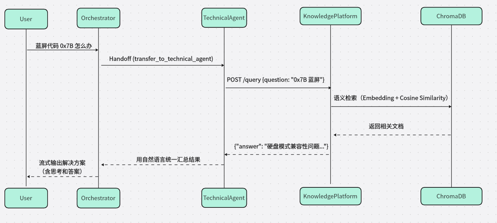
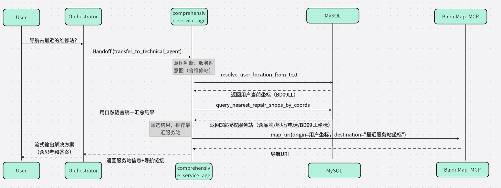

# ITS 智能客服系统 —— 业务架构设计

**主题**: ITS业务架构设计与Agent开发痛点分析

**时长**: 1 节课  

**讲师**：胡中奎

**版本**：v1.0 

## 1、导言：为什么需要 "业务架构"？

在 AI 应用开发中，**技术架构决定系统能否跑起来，而业务架构决定系统能否用得好**。

ITS（Intelligent Technical Service）不是简单的问答机器人，而是一个面向真实 IT 服务场景下一个具备**自主决策、工具调用、多角色协作**能力的智能体集群。它必须回答两类核心问题：

- <strong style='color:red'>怎么修?</strong> → 技术诊断（接入知识库与通用搜索）
- <strong style='color:red'>去哪修?</strong> → 服务引导（接入地图与数据库）

若无清晰的**业务边界**与**协作规则**，系统极易陷入：

- 路由混乱（“踢皮球”）
- 回答幻觉（编造地址或维修步骤）
- 工具误用（参数错乱、权限越界）

以下将从几个维度，深度解析 ITS 的业务架构设计

## 2、系统全景架构：双引擎驱动架构

ITS App 采用了 **Hub-and-Spoke (中心辐射型)** 多智能体架构也即**中枢 + 记忆**双引擎架构，通过明确的分工和高效的 Handoff (交接) 机制，实现能力解耦与专业聚焦，从而保证复杂业务的闭环处理。

| 引擎             | 模块                | 定位     | 核心职责                                                     |
| ---------------- | ------------------- | -------- | ------------------------------------------------------------ |
| **多智能体中枢** | `backend/app`       | “大脑”   | 负责意图识别、任务拆解、智能体调度、外部工具调用（地图、搜索、数据库） |
| **垂类知识平台** | `backend/knowledge` | “海马体” | 私域知识向量化、语义检索、RAG 生成                           |

**设计哲学**：

- **中枢不存知识，只做决策**
- **知识平台不碰业务，只管问答**

## 3、多智能体协作架构 (ITS App)

### 3.1  架构设计理念

**中心化调度**: 所有的用户请求首先由一个“全知全能”的调度器接收，由它决定分发给哪个专家。

**专才专用**: 每个业务智能体只关注自己领域的 Prompt 和工具，避免 Prompt 污染，提升任务成功率。

**流式响应**: 全链路支持 Server-Sent Events (SSE)，让用户感知到智能体的思考过程 (Thinking Process)。

### 3.2、三大智能体的角色与业务边界

#### 1. 调度智能体（Orchestrator）

代码位置: `core_agents/orchestrator.py`

角色: 门房、总指挥。

核心职责:

1. **意图识别**: 分析用户输入是 "电脑坏了" (技术问题) 还是 "哪有维修店" (服务问题)。**要做什么**

2. **智能路由**: 绝不直接回答技术细节（如“蓝屏怎么修”）将会话控制权 `transfer` 给对应的下游智能体。**不做什么**

3. **流式响应**: 实时将智能体的结果推送给用户。

实现细节:

  \-  使用 `Orchestrator` 类封装，维护全局历史消息。

  \-  Prompt 中明确禁止直答，强制 Handoff

>  **边界守则**：**只决策，不执行**

#### 2. 技术顾问智能体 

代码位置: `core_agents/technical_agent.py`

角色: IT 维修专家。

核心职责: 

1. 基于知识库提供故障诊断与操作指南和以及实时资讯类问题。**要做什么**
2. 不处理地理位置相关问题、如访问 MySQL 或地图服务。**不做什么**

工具链:

  \- 	`query_knowledge`: 调用知识库平台的 API 获取私域专业维修方案。

  \-	 MCP: 通过调用阿里百炼平台MCP`bailian_web_search`工具的 API 获取公域问题。

核心业务流程:

1. 接收用户描述 (e.g., "蓝屏代码 0x000001")。

2. 调用 `knowledge_tools.py` 中的 `query_knowledge` 函数。

3. 结合知识库返回的 Markdown 内容，生成易懂的指导步骤。

核心业务流程图:

> **边界守则**：**只问知识，不碰位置**

#### 3. 全能业务智能体

代码位置: `core_agents/comprehensive_service_agent.py`

角色: 生活服务助手。

核心职责:     

- 提供服务站查询、导航、位置解析。**要做什么**
- 不提供具体维修方法，不调用知识库 API 。**不做什么**

工具链:

 \-	MySQL: 查询本地服务站数据库 (`service_station_tools.py`)。

 \-	MCP : 通过调用百度地图平台的map_uri  进行路径规划。

核心业务流程:

1. 接收用户描述 (e.g., "导航去最近的维修站")。

2. 调用 `service_station_tools.py` 中的 `query_nearest_repair_shops_by_coords` 函数以及MCP工具。

3. 返回数据库中最近的服务站导航地址链接。

亮点:

  \-  实现了 `resolve_user_location_from_text`，支持从自然语言或 IP 地址解析用户经纬度。

  \-  实现了 `query_nearest_repair_shops_by_coords`支持基于 Haversine 公式的经纬度距离计算，推荐最近的服务站。

核心业务流程图:

> **安全边界**：
>
> - 服务站坐标**仅来自数据库**，**禁止**使用外部地图API调用（防止坐标准确性失控）
>
>  **边界守则**：**只查位置，不教维修**

#### 4.关键协作规则：

1. **单步执行**：Orchestrator 只处理第一步（路由），不试图一次性解决
2. **信任回调**：子Agent 完成任务后必须调用 `return_to_orchestrator`
3. **结果整合**：Orchestrator 仅做简短收尾（如“已为您找到解决方案”），**不复述详情**

## 4、多 Agent 开发痛点与解决方案

在构建 ITS 系统的过程中，遇到了多智能体系统开发中常见的典型问题。以下是我的实战经验总结。

#### 1. 痛点一：路由死循环与踢皮球

问题描述: 智能体 A 觉得问题该由 B 处理，B 接手后发现处理不了又扔回给 A，或者调度智能体不断地将同一个问题重复分发。

解决方案:

1. **明确的 Handoff 协议**: 我们定义了 `HandoffOutputItem`，强制要求路由必须有明确的目标 `target_agent`。

2. **Prompt 约束**: 在 协调智能体 的 Prompt 中明确列出哪些问题属于哪个领域，特别是边缘案例（Corner Cases）。

3. **状态感知**: 协调智能体 维护全局历史，如果发现最近一次操作已经是转接，则倾向于强制兜底或请求用户澄清，而不是无限重试。

#### 2. 痛点二：Prompt 污染与上下文混乱

问题描述: 如果所有功能都塞在一个大 Prompt 里，模型很容易混淆指令（例如把地图查询的参数用到了知识库搜索上）。

解决方案:

1. **独立 Prompt 文件**: 将各个智能体提示词分开管理。每个 Agent 运行时只加载属于自己的“世界观”。

2. **Runner 隔离**: 代码层面，每个 Agent 是一个独立的类实例。切换 Agent 时，实际上是切换了底层的 Prompt 上下文，但保留了 Conversation History（对话历史），实现了“记忆共享，逻辑隔离”。

​        

#### 3. 痛点三：工具调用的不确定性

问题描述: 模型经常忘记传递必填参数或者工具一旦有多个可能出现工具调用顺序问题。

解决方案:

1. **Pydantic 强类型定义**: 我们使用 Pydantic 模型严格定义工具的入参结构。

2. **工具描述和Prompt 约束****: 在  Prompt 中使用了 Few-Shot Learning (少样本学习)，明确列出哪些问题该调用哪个工具，以及如何编排这些工具调用。

#### 4. 痛点四：异构服务集成复杂性 

问题描述: 地图服务是 HTTP API，数据库是 SQL，知识库是向量检索。每增加一个外部能力，都要写大量的胶水代码。

解决方案:

1. 引入 MCP (Model Context Protocol): 对于百度地图和搜索这种外部通用服务，我们遵循 MCP 思路进行封装。

2. 统一接口: 无论底层是 SQL 还是 API，对 Agent 来说都是统一的 `function_tool`。Agent 只需要关心 `tool_name` 和 `arguments`，不需要关心底层实现协议。

#### 5. 痛点五：调试与可观测性差 

问题描述: 用户问了一个问题，系统没反应，或者回答得很奇怪。不知道是路由错了，还是工具挂了，还是 LLM 抽风了。

解决方案:

1. 结构化日志: 通过时间监听机制在日志中实现了调用模型详细的日志记录。每一次 `Thinking`，每一次 `Tool Call`，每一次 `Handoff` 都有迹可循。

2. SSE 流式透传: 将后端的“思考过程”通过 SSE 实时推送到前端。用户不仅看到结果，还能看到“正在查询数据库...”、“正在切换专家...”，这极大地提升了用户体验，也方便了开发者调试。

## 5、架构优势总结与扩展

### 5.1 架构优势总结

#### 1. 解耦性

- **业务逻辑**（App）与**知识数据**（Knowledge）完全分离
- 可独立迭代

#### 2. 可扩展性

- 新增能力只需：
  1. 实现新工具（如高德地图 MCP）
  2. 在对应 Agent 的 handoffs 中注册
- 无需修改调度器核心逻辑

#### 3. 可观测性

- 日志覆盖：意图识别 → 智能体切换 → 工具调用 → 结果返回
- 用户可见“系统正在为您查询...”，提升信任感

#### 4. 安全性

- 服务站数据源锁定（MySQL 只读）
- 外部 API 调用标准化（MCP 封装）
- 权限最小化（Agent 仅访问必要工具）

### 5.2 扩展方向

| 方向             | 当前状态      | 规划                                     |
| ---------------- | ------------- | ---------------------------------------- |
| **知识库闭环**   | 只读          | 增加用户反馈打分 → 自动优化知识切片      |
| **路径规划增强** | 直线距离推荐  | 接入 MCP 路径规划 → 返回驾车/步行时间    |
| **多轮澄清**     | 一次性回答    | 对模糊问题主动追问（如“您在哪个城市？”） |
| **Agent 自注册** | 静态 handoffs | 动态发现可用 Agent，支持插件化扩展       |

> 业务架构的本质是“划清责任”**好的 AI 系统，不是让模型无所不能，而是让每个组件各司其职、各安其位。**ITS 的多智能体架构不仅仅是技术的堆砌，更是对**业务边界**的深刻理解。
>
> - **Orchestrator** 负责“分对人”守住了入口，保证了系统的有序性。
> - **Technical Agent** 负责“答对事”守住了专业度，保证了回答的准确性
> - **Comprehensive Agent** 负责“指对路”守住了执行力，连接了外部物理世界。
>
> 通过清晰的边界、严格的协议与透明的协作，我们构建了一个**既智能又可信**的服务系统。

