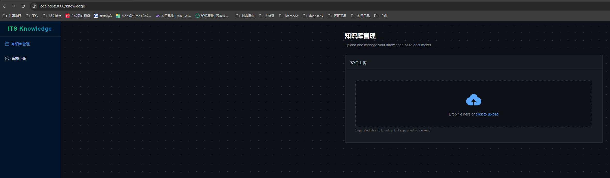

# ITS 智能客服系统 —— 知识库构建实战


**主题**: 从零构建企业级 RAG 知识库 - 核心原理与入库实战  

**时长**: 1-2 天  

**讲师**：胡中奎

**版本**：v1.0 


## 1、任务目标

**1.1 理论知识：**

1. 理解 **RAG (检索增强生成)** 的核心概念
2. 掌握 **向量数据库 (Vector Database)** 的工作原理


**1.2 动手实战**: 基于 Python + LangChain + ChromaDB 搭建一套完整的知识库入库系统。

1. 导入知识库平台前端项目
2. 搭建本地知识库问答系统的整体基础架构
3. 接入FastAPI Web 框架和Pyton中的异步编程
4. 开发 `/upload` 接口，完成私域知识到知识库的编码


## 2、核心概念扫盲 

### 2.1 RAG相关概念

#### 1. 什么是 RAG？

大模型 (LLM) 就像一个“博学的博士”，但他有两个缺点：

1. **知识时效性问题**: 他的知识只更新到训练结束的那一天（比如 2023 年）。

2. **幻觉问题**: 不知道的事他可能会一本正经的胡说八道。

**RAG (Retrieval-Augmented Generation)** 就是给这位博士配了一个“图书馆” (知识库)。当你有问题时：

1. 先去图书馆查阅相关资料 (Retrieval)。

2. 把资料和问题一起交给博士。

3. 博士结合资料回答问题 (Generation)。


#### 2. 机器如何理解文字？

电脑不认识中文“苹果”，它只认识数字。

**Embedding (向量化)** 就是把一段文字变成一组数字（向量）。

\*  `"苹果"` -> `[0.1, 0.8, -0.5, ...]`

\*  `"香蕉"` -> `[0.2, 0.7, -0.4, ...]` (离苹果很近)

\*  `"卡车"` -> `[0.9, -0.1, 0.8, ...]` (离苹果很远)


####  3. 什么是向量数据库？

顾名思义就是存储文本的向量值，和传统的数据库比如MySQL有什么区别？传统的 MySQL 数据库通过关键词匹配 (如 `WHERE content LIKE '%苹果%'`)。

**向量数据库 (ChromaDB)** 通过**相似度计算** (计算向量之间的距离) 来找答案。即使你搜“红富士”，也能找到“苹果”，因为它们在向量空间里靠得很近。


### 2.2 FastAPI概念

#### 1. 什么是 FastAPI？

想象你要开一家“智能客服接待站”，用户通过网页或 App 发送问题（比如上传文件、提问），你的程序需要**快速响应**并返回结果。

**FastAPI** 就是一个帮你搭建这个“接待站”的工具。它是一个用 Python 写的现代 Web 框架，专门用来**创建 API 接口**（也就是程序对外服务的“窗口”）。

它的两大优点特别适合 AI 项目：

1. **快**：性能接近底层 C 语言写的框架，能扛住大量请求。
2. **自动文档**：写完接口，自动生成可视化测试页面（Swagger UI），不用额外写文档。

简单说：**FastAPI = 你程序的“前台接待员”**，负责接收请求、调用内部逻辑、返回答案。


#### 2. 为什么要用 FastAPI？

在我们的知识库项目中，有两个关键操作需要对外提供服务：

- **上传文件** → 供用户把私域知识手册发给系统
- **提问查询** → 供用户找到相关问题比如“蓝屏怎么办？”


#### 3. FastAPI如何使用？

FastAPI 让我们用几行代码就能定义这些“服务窗口”：

```python
@app.post("/upload")          # 定义一个“上传”窗口
async def upload_file(...):   # 当有人访问 /upload，就执行这个函数
    ...                       # 处理文件并存入知识库
```

不过一般要结合uvicorn web服务器使用伪代码如下：

```python
import  os
import uvicorn
from fastapi import FastAPI

app = FastAPI(
    title="Fast API",
    version="1.0.0",
    description="Fast API",
)

@app.post("/upload")          # 定义一个“上传”窗口
async def upload_file(...):   # 当有人访问 /upload，就执行这个函数
    ...                       # 处理文件并存入知识库

def start_server():
    """启动服务器"""
    host = os.getenv("API_HOST", "0.0.0.0")
    port = int(os.getenv("API_PORT", "8001"))

    uvicorn.run(
        "api.main:app",
        host=host,
        port=port
    )

if __name__ == "__main__":
    start_server()

```


这样启动服务后就可以在前端直接访问，而且，启动服务后，打开浏览器访问 `http://localhost:8001/docs`，就能看到一个**自带测试功能的网页**，直接上传文件、查看结果——这对开发和调试都很友好！**FastAPI 就是帮你把 Python 函数变成一个别人能调用的网址接口**。


### 2.3 异步编程概念

#### 1. 什么是异步编程？

想象你在一家咖啡店点单：

- **同步方式（传统）**：你点一杯咖啡，店员必须等这杯做完、递给你之后，才能接待下一位顾客。如果做咖啡要 5 分钟，后面的人都得干等着。
- **异步方式（现代）**：你点完单，店员立刻接下一位的订单，同时咖啡机在后台自动煮你的咖啡。谁都不用干等，效率翻倍！

**Python 的异步编程（async/await）** 就是这种“不干等”的工作模式。它允许程序在**等待慢操作**（比如读文件、调用网络 API）时，先去处理其他任务，等结果 ready 了再回来继续。简单说：**异步 = 让程序“边等边干别的事”，避免卡住**。


#### 2. 为什么要用异步？

在我们的知识库项目中，以下操作都很“慢”

- **上传大文件** → 要从网络读取数据
- **调用 Embedding 模型** → 要发 HTTP 请求到远程服务器（可能几百毫秒）
- **写入向量数据库** → 要把数据持久化到硬盘

而 FastAPI 默认支持异步，配合 `async` / `await`，就能让服务**同时处理多个请求**，用户体验更流畅。


#### 3. 异步如何使用？


普通接口中，我们这样写异步函数：

- 使用 `async def` 定义异步函数
- 使用 `await` 等待异步操作
- 使用 `asyncio.run()` 运行主异步函数

```python
import asyncio

# 定义一个异步函数
async def say_hello():
    print("Hello")
    await asyncio.sleep(1)  # 模拟异步操作
    print("World")

# 运行异步函数
async def main():
    await say_hello()  # 等待异步函数完成

# 启动事件循环
if __name__ == "__main__":
    asyncio.run(main())   # ← 这里是同步世界的入口点 是同步世界通往异步世界的桥梁


```

异步的核心在于`await`时的"让出控制权"，让CPU在等待I/O时可以去处理其他任务，从而实现并发。


**注意**：

- 要使 `await` 工作，它必须位于支持这种异步机制的函数内。因此，只需使用 `async def` 声明它，而不是 `def`
- **`await` 只能在 `async def` 定义的函数内部使用，而 `async def` 函数返回的是协程对象，需要被"驱动"执行。这就产生了一个启动问题：第一个异步函数由谁来调用？**


如果使用异步运行时环境 **FastAPI**，就不需要担心这一点，框架自动处理事件循环，你只需写 `async def` 路径函数

```python
from fastapi import FastAPI
app = FastAPI()
@app.get("/")
async def hello():  # ← FastAPI 负责驱动这个异步函数
    return {"Hello": "World"}
```

- `async def`：表示这是一个“可以暂停”的函数
- `await`：表示“这里要等一下”，但**不是整个程序卡住**，而是让出控制权给其他任务


### 2.4 LangChain的概念

#### 1. 什么是 LangChain？

想象你要组装一台“AI问答机器人”，需要完成一连串复杂操作：
 读取用户上传的 PDF → 把内容切成小段 → 转成向量 → 存进数据库 → 用户提问时再找回来 → 交给大模型生成答案……

如果每一步都自己写代码，就像**徒手造汽车**：要懂轮胎、引擎、电路、座椅……太难了！

**LangChain** 就是这个领域的“乐高积木套装”。它是一个专为大模型应用开发设计的 Python 工具包，把常见任务（读文件、切文本、调模型、连数据库等）都封装成了**简单易用的模块**，你只需要像拼积木一样组合它们。简单说：**LangChain = 开发 AI 应用的“瑞士军刀”**，让你专注业务逻辑，不用重复造轮子。


#### 2. 为什么要用 LangChain？

在我们的知识库项目中，LangChain 帮我们轻松实现了三大核心能力：

- **加载文档**：用 `TextLoader`  一行代码读取 TXT。
- **智能切分**：用 `RecursiveCharacterTextSplitter` 自动按段落、句子切块，保留上下文。
- **对接向量库**：用 `Chroma.from_documents()` 一键把文本存入 ChromaDB，并自动完成向量化。
- **调用大模型** 用llm.invoke(query) 一行代码直接调用大模型，并获取模型返回结果。

如果没有 LangChain，光是处理不同格式的文件、调用 Embedding 接口、管理数据库连接，调用大模型就要写上百行底层代码。


#### 3. LangChain 怎么用？

```python
! pip install  load_dotenv
! pip install  langchain_chroma
! pip install langchain_openai
! pip install langchain
```


```python
#  1.加载环境配置信息
from dotenv import load_dotenv
import os
# 2.加载配置文件
load_dotenv()

# sk-3fNNVrOHy9YbLm87IQZdCe9VZDI9rA5CcCRfe9Nw2w9yyEAT
# https://api.openai-proxy.org/v1
os.environ["OPENAI_API_KEY"] = os.getenv("OPENAI_API_KEY")
os.environ["OPENAI_API_BASE"] = os.getenv("OPENAI_API_BASE")


# ==============================
# 第一步：构建知识库（入库）
# ==============================
from langchain_classic.text_splitter import RecursiveCharacterTextSplitter
from langchain_classic.document_loaders import TextLoader
from langchain_chroma import Chroma
from langchain_openai import OpenAIEmbeddings

# 1. 加载本地知识文件（例如 IT 故障处理指南）
loader = TextLoader("./asset/repair_guide.md", encoding="utf-8")
docs = loader.load()

# 2. 将长文本切分为小块（便于精准检索）
text_splitter = RecursiveCharacterTextSplitter(
    chunk_size=500,
    chunk_overlap=0
)
chunks = text_splitter.split_documents(docs)

# 3. 向量化并存入 Chroma 向量数据库（自动持久化到磁盘）
vector_store = Chroma.from_documents(
    documents=chunks,
    embedding=OpenAIEmbeddings(),
    persist_directory="./chroma"
)
print("✅ 知识库构建完成，已保存到 ./chroma")


# ==============================
# 第二步：基于知识库进行问答（RAG）
# ==============================
from langchain_openai import ChatOpenAI
from langchain_core.prompts import ChatPromptTemplate

# 4. 重新加载已保存的向量库（模拟服务重启后仍可使用）
reloaded_vector_store = Chroma(
    persist_directory="./chroma",
    embedding_function=OpenAIEmbeddings()
)

# 5. 用户提问
question = "如何使用U盘安装Windows 7操作系统？"

# 6. 检索与问题最相关的 2 个知识片段
retriever = reloaded_vector_store.as_retriever(search_kwargs={"k": 2})
relevant_docs = retriever.invoke(question)

# 7. 将检索结果拼接为上下文
context_text = "\n\n".join([doc.page_content for doc in relevant_docs])

# 8. 构造带上下文的提示词（Prompt）
prompt_template = ChatPromptTemplate.from_messages([
    ("system", "你是一个IT技术支持专家，请严格根据以下资料回答问题。如果资料中没有相关信息，请回答“我不知道”。"),
    ("user", "资料：{context}\n\n问题：{question}")
])
prompt = prompt_template.format(context=context_text, question=question)

# 9. 调用大模型生成答案（核心：使用 invoke）
llm = ChatOpenAI(model_name="gpt-4")
answer = llm.invoke(prompt)

# 10. 输出最终回答
print("\n❓ 问题：", question)
print("📚 检索到的相关资料：\n", context_text)
print("\n🤖 回答：", answer.content)
```


## 3、项目环境与结构 

### 3.1准备项目环境

3.1 创建一个新的文件项目目录名为its_project/backend/knowlege，这是 ITS 系统的“大脑皮层”。

3.2 创建一个新的文件项目目录名为its_project/front，这是 ITS 系统的“知识库平台前端”。

3.3 将前端项目its_knowlege_platform_ui复制到its_project/front下。

3.4 在knowlege目录下创建.venv虚拟环境（名字任意），并激活。该步骤用命令或者pycharm开发工具都可以。

3.5 在its_knowlege_platform_ui项目的终端中安装并启动前端项目

```shell
npm  install 
npm run dev 
```

3.6 访问http://localhost:3000/knowledge，页面效果如下图




### 3.2 知识库项目结构搭建

打开 Pycharm工具，找到 `backend/knowledge`：

创建如下目录结构：

```python
knowledge/   这是 ITS 系统的“大脑皮层”。
├── data_access/  #	数据访问层 (对数据管理)
│   ├── __init__.py   #	用于创建Python包
│   ├── file_repository.py 		#	封装本地文件读写操作，统一处理文件 I/O
│   ├── knowledge_api_client.py # 	对接联想官方知识服务 API，用于批量拉取原始故障知识数据
│   └── vector_store_manager.py #	封装 ChromaDB 向量数据库操作，提供向量存储等接口

├── business_logic/  #	业务逻辑层 （真正干活的）
│   ├── __init__.py  #	同样用于创建Python包
│   ├── document_service.py 	#  将从 API 获取的结构化知识数据，转换为标准化的 Markdown 文档格式
│   ├── file_processor.py		#  加载并解析 .md 文件，生成 LangChain 的 Document 对象，为向量化做准备
│   └── retrieval_service.py	#  基于用户问题，从向量库中检索最相关的知识片段
│   ├── query_service.py		#  整合检索结果与用户问题，调用大语言模型（LLM）生成最终回答

├── presentation/	#	表现层 （对外交互窗口）
│   ├── __init__.py #	同样用于创建Python包
│   ├── api/ 		#	提供Web API 接口，供前端或外部系统调用
│   │   ├── __init__.py   		#	同样用于创建Python包
│   │   ├── routes.py			#	定义核心接口，如 /upload（上传并入库文档）、/query（提问并获取答案）构成完整的RAG服务入口
│   │   └── schemas.py			#   使用 Pydantic 定义请求/响应的数据模型，确保接口清晰。
│   │   ├── main.py				#	FstAPI 应用入口，启动 Web 服务
│   └── cli/ # 命令行相关的脚本
│       ├── __init__.py  		#	同样用于创建Python包
│       ├── crawl_cli.py  		#   一键爬取联想官网故障知识，存为结构化数据
│       └── upload_cli.py       #   持从命令行批量上传 Markdown 文件到向量库

├── config/  # 配置相关
│   ├── __init__.py 			#	同样用于创建Python包
│   ├── constants.py			#   定义系统级常量（如默认分块大小、文件路径等）
│   └── settings.py 			#	集中管理运行时配置（如大模型名称、API 密钥等）
├── utils/  # 工具相关
│   ├── __init__.py				#	同样用于创建Python包
│   └── text_utils.py			#	提供文本清洗、格式转换等通用工具函数


├── .env  						# 存储环境变量
├── requirements.txt			# 列出所有 Python 依赖，确保环境一致性
├── README.md					# 项目简介、快速启动指南与开发规范。
└── run_server.py				# 启动 FastAPI 服务的主脚本，开发时直接运行即可。
```

**说明：**整体采用分层架构设计，便于开发、测试与维护。

**提示**：以上目录和模块**无需在项目初期全部创建**。该结构主要帮助大家理解系统整体结构与各模块职责，后续可根据实际开发节奏逐步实现。


### 3.3 关键技术栈

**LangChain**: 开发大模型应用的瑞士军刀。

**ChromaDB**: 轻量级、开源的向量数据库 (无需安装服务器，本地运行)。

**FastAPI**: 现代、快速的 Python Web 框架。

**OpenAI Embeddings**: 用于将文本转化为向量 (本项目兼容 OpenAI 接口协议)。


## 4、构建知识库流水线 

构建知识库的过程，就像**做一道好菜**，需要经过五个关键步骤：

1. **采购（Upload）**：获取原始数据源，如同挑选新鲜食材。
2. **清洗（Clean）**：对数据进行结构化整理，转换为标准 Markdown 格式，去除杂质、保留精华。
3. **备菜（Loading & Splitting）**：将 Markdown 文件加载为文档对象，并按语义合理切分为小块（Chunks），便于后续处理。
4. **烹饪（Embedding）**：通过大模型将文本“烹制”为高维向量，赋予其语义理解能力。
5. **装盘（Indexing）**：将向量存入向量数据库（如 ChromaDB），完成知识的高效组织与就绪，随时上桌服务。


### 4.1 获取原始数据源以及清洗

#### 1. 目标

把外部知识“搬”进我们的系统，作为构建知识库的第一步。

**模块位置**: `presentation/cli/crawl_cli.py`、 `data_access/knowledge_api_client.py`、`utils/text_utils.py`、`data_access/file_repository.py`

#### 2. 需求分析

1.知识来自哪里？

- 来源：**联想官方公开知识库**
  网址：`https://iknow.lenovo.com.cn`
- 内容类型：电脑故障解答、系统安装指南、软件使用说明等
- 特点：每条知识都有唯一编号（如 `knowledgeNo=111`），结构清晰（包含标题、问题、解决方案等）
-  这些内容是**真实、权威、可公开访问**的，适合作为我们的知识来源


2.我们怎么“抓”数据？

所以这里面就要实现一个小工具，编码完成“抓取”工作：

- 给定一个编号范围（比如 1 到 1000）
- 自动向联想服务器发送请求：
  `GET /api/knowledge?knowledgeNo=1`
- 接收返回的结构化数据（JSON 格式）
- 把数据转换成标准 Markdown 文档

 背后调用的模块：

- `knowledge_api_client.py`：负责联网请求
- `document_service.py`：负责转成 Markdown


3.要不要持久化到本地文件？

**要！而且必须保存。**

- **为什么？**

  避免重复请求（节省时间、减少服务器压力）

  即使原网站关闭，我们仍有备份

  后续步骤（切分、向量化）都需要读取这些文件

- **保存在哪？**

  默认保存在本地文件夹，例如：

  ```reStructuredText
  ./data/raw/
  ├── 0001-如何安装Win7.md
  ├── 0002-电脑蓝屏怎么办.md
  └── ...
  ```

- **文件命名规则**：
   `{编号}-{标题}.md`，方便查找和管理。

  这里拼接标题作为文件名很重要，后面可以在检索的时候，优化检索结果的质量，提高文档的召回率。

-  背后调用的模块：

  - `text_utils.py`：负责处理文件名
  - `file_repository.py`：负责转成将 Markdown文件存储到本地


#### 3. 实现流程

当执行爬虫命令（如 `python crawl_cli.py --start 1 --end 1000`）时，系统按以下步骤完成原始知识的获取与清洗：

1. **发起 API 请求**
   - 调用 `KnowledgeApiClient.fetch_knowledge_content(knowledgeNo)`
   - 向联想知识库接口发送 GET 请求，获取 JSON 格式的原始数据
2. **验证并提取有效内容**
   - 检查返回数据是否包含 `content` 字段
   - 若无内容或请求失败，记录日志并跳过该编号
3. **结构化转 Markdown**
   - 调用 `DocumentService.generate_markdown_content(data, number)`
   - 将标题、摘要、分类、关键词、解决方案等字段组织为标准化 Markdown
   - 在文档末尾添加注释行（如 `<!-- 文档主题: ... -->`）以增强分块后语义完整性
4. **生成安全文件名**
   - 使用 `TextUtils.clean_filename(title)` 移除非法字符（如 `/`, `?`, `*` 等）
   - 截断过长标题（≤50 字符），避免操作系统文件名限制问题
   - 按格式 `{编号}-{标题}.md` 命名（如 `0002-电脑蓝屏怎么办.md`）
5. **持久化到本地**
   - 调用 `FileRepository.save_file(md_content, file_path)`
   - 将生成的 Markdown 内容写入 `./data/raw/` 目录
   - 保证后续切分、向量化等环节可离线复用，无需重复请求
6. **控制请求频率**
   - 每次请求后休眠指定时间（默认 0.2 秒）
   - 避免触发服务器限流，保障稳定抓取


#### 4. 代码实现

`knowledge_api_client.py`模块代码如下：

```python
import requests
from config.settings import settings
from services.crawler.parser import HtmlParser
from repositories.file_repository import FileRepository
from typing import Dict,Any

class KnowledgeApiClient:
    """知识库ApiClient"""
    @staticmethod
    def fetch_knowledge_content(knowledgeNo:int)->Dict[str, Any]:
        try:
            """爬取联想知识库知识内容"""
            base_url = settings.KNOWLEDGE_BASE_URL
            # 1.构建url
            url = f"{base_url}/knowledgeapi/api/knowledge/knowledgeDetails"
            # 2.构建请求参数
            params = {"knowledgeNo" :knowledgeNo}
            # 3.发送请求
            response=requests.get(url=url, params=params,timeout=10)
            # 处理响应
            response.raise_for_status()
            return  response.json().get('data')
        except requests.exceptions.RequestException as e:
            raise   requests.exceptions.RequestException(f"HTTP请求失败,原因:{e}")


```

`presentation/cli/crawl_cli.py`模块代码如下：

```python
import argparse
import sys
import os

from  services.crawler.client import KnowledgeApiClient
from  services.crawler.parser import HtmlParser
from  utils.text_utils import  TextUtils
from  config.settings import  settings
from  repositories.file_repository import FileRepository


def main():
    parser = argparse.ArgumentParser(description="从联想知识库爬取并生成结构化Markdown文档")
    parser.add_argument("--start", type=int, required=True, help="起始 knowledgeNo")
    parser.add_argument("--end", type=int, required=True, help="结束 knowledgeNo")
    parser.add_argument("--out", type=str, default="./data/raw", help="输出目录")
    parser.add_argument("--delay", type=float, default=0.2, help="请求间隔（秒）")
    
    args = parser.parse_args()

    # 确保输出目录存在
    os.makedirs(args.out, exist_ok=True)

    success = 0
    failed = 0

    for i in range(args.start, args.end + 1):
        print(f"[{i}/1000] 获取KnowledgeNo:{i}")

        knowledge_content=KnowledgeApiClient.fetch_knowledge_content(knowledgeNo=i)

        if knowledge_content and knowledge_content['content']:

            # 1.创建HTML解析器
            parser = HtmlParser()

            # 2.解析HTML为MarkDown
            md_content=parser.parse_html_to_markdown(knowledge_content['content'],i)

            # 3.生成语义化文件名 {KnowledgeNo}1-{title}.md
            # 3.1 获取文件名
            md_title=knowledge_content.get('title',"无标题")

            # 3.2 清洗文件名（非法字符处理）
            clean_title=TextUtils.clean_filename(md_title)

            # 3.3 限制文件名长度
            if len(clean_title)>50:
                clean_title=clean_title[:50].rstrip("_")

            # 4.构建MarkDown文件名
            file_name=f"{i:04d}-{clean_title}.md"

            # 5.构建文件路径
            file_path=os.path.join(settings.CRAWL_OUTPUT_DIR, file_name)

            # 6.保存文件到指定目录
            FileRepository.save_file(md_content,file_path)
            success+=1
            print(f" {i}-> 保存成功:{file_name} ")

        else:
            fail+=1
            print(f" {i}-> 暂无内容,保存失败")
        time.sleep(200)
    
    print(f"\n✅ 爬取完成! 成功: {success}, 失败: {fail}")

if __name__ == "__main__":
    main()

```


`text_utils.py`模块代码如下：

```python
from bs4 import BeautifulSoup,Tag
from markdownify import markdownify as md
import re


class TextUtils:
    @staticmethod
    def html_to_markdown(html_content: str) -> str:
        """
        HTML转Markdown (包含必要的 DOM 清洗)
        """
        if not html_content:
            return ""

        # 1. 使用 BeautifulSoup 进行结构化清洗
        soup = BeautifulSoup(html_content, 'html.parser')

        # 1.1 移除完全无用的标签 (噪音) ---
        # 移除 script, style 标签
        for tag in soup(["script", "style", "noscript"]):
            tag.decompose()

        # 1.2  移除特定广告或无用元素（扩展）
        for ad in soup.select('.mceNonEditable'):
            ad.decompose()

        # 核心逻辑：合并相邻的 strong/b 标签
        # 场景：<strong>A</strong><strong>B</strong> -> <strong>AB</strong>

        # 查找所有的加粗标签
        bold_tags = soup.find_all(['strong', 'b'])
        for tag in bold_tags:
            # 安全检查：如果标签在之前的循环中已经被合并（删除）了，跳过
            if not tag.parent:
                continue
            # 获取下一个兄弟节点
            next_sibling = tag.next_sibling

            # 判断条件：
            # 1. 下一个兄弟存在
            # 2. 下一个兄弟也是 Tag 对象 (不是纯文本换行符)
            # 3. 下一个兄弟的标签名相同 (都是 strong 或 都是 b)
            if next_sibling and isinstance(next_sibling, Tag) and next_sibling.name == tag.name:
                # 【合并动作】
                # 1. 把下一个标签里的内容（文字或子标签）全部追加到当前标签里
                tag.extend(next_sibling.contents)
                # 2. 销毁下一个标签
                next_sibling.decompose()

        # 2. 将清洗后的 HTML 转为字符串
        cleaned_html = str(soup)

        # 3. 使用 markdownify 转换
        markdown_text = md(cleaned_html)
        return markdown_text

    @staticmethod
    def clean_filename(filename: str) -> str:
        """清洗文件名中的非法字符"""
        if not filename:
            return "untitled"
        illegal_chars = r'[\\/:*?"<>|]'
        return re.sub(illegal_chars, '-', filename)
```


`file_repository.py`模块代码如下：【作为工具使用】

```python
import os
import hashlib
from typing import List, Dict, Any

class FileRepository:
    @staticmethod
    def get_file_hash(file_path: str) -> str:
        """计算文件的MD5哈希值"""
        hash_md5 = hashlib.md5()
        with open(file_path, 'rb') as f:
            for chunk in iter(lambda: f.read(4096), b""):
                hash_md5.update(chunk)
        return hash_md5.hexdigest()

    @staticmethod
    def remove_duplicate_files(file_paths: List[str]) -> List[str]:
        """去除重复文件，基于内容哈希"""
        unique_files = {}
        unique_file_paths = []

        for file_path in file_paths:
            try:
                file_hash = FileRepository.get_file_hash(file_path)
                if file_hash not in unique_files:
                    unique_files[file_hash] = file_path
                    unique_file_paths.append(file_path)
                else:
                    print(f"发现重复文件，跳过: {file_path} (与 {unique_files[file_hash]} 内容相同)")
            except Exception as e:
                print(f"计算文件哈希时出错 {file_path}: {str(e)}")
                # 出错时仍保留文件
                unique_file_paths.append(file_path)

        return unique_file_paths

    @staticmethod
    def read_file_content(file_path: str) -> str:
        """
        读取文件内容
        :return: 成功返回文件内容，失败返回空字符串 ""
        """
        if not file_path or not os.path.exists(file_path):
            print(f"文件不存在或路径为空: {file_path}")
            return ""

        try:
            # 尝试以 UTF-8 读取
            with open(file_path, 'r', encoding='utf-8') as f:
                return f.read()

        except UnicodeDecodeError:
            # 常见错误：文件不是 UTF-8 格式（例如是 GBK）
            print(f"文件编码错误(非UTF-8): {file_path}")
            # 可选：这里可以尝试用 'gbk' 重试读取，或者直接返回空
            return ""

        except OSError as e:
            # 捕获权限不足、文件被占用等系统IO错误
            print(f"读取文件IO错误: {file_path}, 原因: {e}")
            return ""

        except Exception as e:
            # 捕获其他未知错误
            print(f"读取未知错误: {file_path}, 原因: {e}")
            return ""

    @staticmethod
    def save_file(content: str, file_path: str):
        """保存内容到文件"""
        try:
            if not content:
                print(f"内容为空，跳过保存: {file_path}")
                return

            directory = os.path.dirname(file_path)
            if directory:
                os.makedirs(directory, exist_ok=True)

            with open(file_path, 'w', encoding='utf-8') as f:
                f.write(content)
        except OSError as e:
            # 专门捕获文件系统错误 (如权限问题)
            print(f"保存文件失败: {file_path},原因：{e}")
        except Exception as e:
            print(f"发生未知错误: {e}")

    @staticmethod
    def list_files(directory: str, extension: str = None) -> List[str]:
        """
        列出目录下的文件
        :param extension: 过滤后缀，例如 '.md' (不区分大小写会更好)
        """
        files = []

        # 1. 基础校验
        if not directory:
            print("目录路径为空")
            return files

        if not os.path.exists(directory):
            print(f"目录不存在: {directory}")
            return files

        # 2. 确保它真的是个目录，而不是文件
        if not os.path.isdir(directory):
            print(f"路径不是一个有效的目录: {directory}")
            return files

        try:
            # os.listdir 可能会因为权限问题报错
            file_names = os.listdir(directory)

            for filename in file_names:
                # 过滤后缀 (建议转小写比较，更加健壮)
                if extension:
                    if not filename.lower().endswith(extension.lower()):
                        continue

                # 拼接完整路径
                full_path = os.path.join(directory, filename)
                files.append(full_path)

            return files

        except PermissionError:
            print(f"权限不足，无法访问目录: {directory}")
            return files
        except OSError as e:
            print(f"遍历目录出错: {directory}, 原因: {e}")
            return files
        except Exception as e:
            print(f"未知错误: {directory}, 原因: {e}")
            return files

```


### 4.2 加载md数据并切分

#### 1. 目标

把已保存的本地 Markdown 文件读入内存，并按语义合理切分成小块（chunks），为后续向量化和检索做准备。

**模块位置**: `presentation/api/routes.py`、`business_logic/file_processor.py`


#### 2. 需求分析

1.**如何获取到 Markdown 文件**？

- 通常有两种方式获取待处理的 `.md` 文件：

1.1 批量本地加载（离线模式）

- 爬虫工具预先从联想知识库抓取并生成大量 `.md` 文件
- 存储于 `./data/raw/` 目录下，如 `0001-如何安装Win7.md`
- 适用于初始化知识库或定期全量更新

1.2 用户上传（在线模式)

- 通过管理平台前端调用 `/upload` 接口上传任意 `.md` 文件
- 后端临时保存后交由 `FileProcessor` 处理
- 适用于私有知识补充（如内部运维手册、项目 FAQ）

无论来源如何，所有文件最终都经过**统一的加载 → 切分 → 向量化**流程，保证处理逻辑一致性。


**2.为什么需要“切分”？**

- 大模型有**上下文长度限制**（例如最多处理 4096 个 token）。
- 如果一篇知识文档很长（如上万字的安装指南），直接作为整体：
  - 可能超出模型输入上限 → 报错或强制截断
  - 在检索时，整篇内容与问题的相关性被稀释 → 降低召回准确率

但**我们的知识库文档普遍较短**（多为 1000~3000 字的故障解答），若强行按小 chunk（如 500 字）切分，反而会导致：

- 单个知识点被割裂
- 向量表示碎片化，影响语义完整性

因此，**切分策略需适配数据特点**,因为获取到的知识库文档内容比较短，中字符数都不会很多，直接将一个文档作为一个 chunk单位,这样就可以避免碎片化导致的语义丢失，进行向量检索时，整篇 embedding 也更准确。


**3.我们怎么切分？**

使用 LangChain 提供的智能文本切分器 `RecursiveCharacterTextSplitter`,**调整参数以适应短文档场景**

- **`chunk_size = 3000`**（约 1500 中文字符）
   覆盖绝大多数知识条目（实测平均长度 < 1000 字），**让整篇文档作为一个 chunk**
- **`chunk_overlap = 200`**
   仅在极少数超长文档中启用重叠，避免关键信息断裂
- **按 `\n\n`、标题、列表等语义边界优先切分**
   确保即使分割，也保持段落完整

>  **策略总结**：
>  **能不切就不切，必须切时按语义切**。
>  这样既避免碎片化，又保留扩展性——未来若引入长手册，无需修改架构即可兼容。


#### 3. 实现流程

当用户上传文件或系统批量处理本地 `.md` 文件时，`FileProcessor` 按以下步骤完成文档加载、切分与入库：

1. **接收并暂存文件**

   - 在 `/upload` 接口中，将上传的文件写入临时路径（如 `/tmp/tmp12345.md`）
   - 保留原始文件扩展名，便于后续识别格式

2. **加载文档内容**

   - 调用 `TextLoader(file_path, encoding="utf-8")` 读取文件
   - 即使内容含 HTML 标签或 Markdown 语法，也能以纯文本形式正确加载
   - 若加载失败（如编码错误、文件损坏），抛出异常并记录日志

3. **智能切分文档**

   - 使用`RecursiveCharacterTextSplitter`对文档进行语义分割
     - `chunk_size = CHUNK_SIZE`（建议设为 3000，适配短知识条目）
     - `chunk_overlap = CHUNK_OVERLAP`（如 200，防止关键信息被切断）
   - 目标：**短文档整篇保留，超长文档可以按段落边界合理切分**

4. **过滤无效块**

   - 调用 `filter_complex_metadata()` 移除嵌套过深或非 JSON 序列化的元数据
   - 剔除 `page_content` 为空或仅含空白字符的 chunk，确保入库质量

5. **持久化到向量数据库**

   - 调用 `VectorStoreManager.add_documents()`
   - 使用 `OpenAIEmbeddings` 对每个 chunk 向量化
   - 通过 `Chroma` 批量写入（默认 batch_size=32）至持久化目录（如 `./data/vectorstore`）
   - 返回成功入库的 chunk 数量

   

#### 4. 代码实现

`routes.py`模块代码如下：

```python
import os
import tempfile
from fastapi import APIRouter, UploadFile, File, HTTPException
from backend.knowledge.presentation.api.schemas import QueryRequest, QueryResponse, UploadResponse
from backend.knowledge.business_logic.file_processor import FileProcessor
from backend.knowledge.business_logic.retrieval_service import RetrievalService
from backend.knowledge.business_logic.query_service import QueryService

router = APIRouter()

# 实例化服务
file_processor = FileProcessor()
retrieval_service = RetrievalService()
query_service = QueryService()

@router.post("/upload", summary="上传文件到知识库", response_model=UploadResponse)
async def upload_file(file: UploadFile = File(...)):
    # 保存上传的文件到临时路径
    suffix = os.path.splitext(file.filename)[1]
    with tempfile.NamedTemporaryFile(delete=False, suffix=suffix) as temp_file:
        content = await file.read()
        temp_file.write(content)
        temp_file_path = temp_file.name

    try:
        # 调用业务逻辑处理文件
        chunks = file_processor.process_and_save_file(temp_file_path)
        return UploadResponse(
            status="success",
            message="文件已成功存入知识库",
            file_name=file.filename,
            chunks_added=chunks
        )
    except Exception as e:
        import traceback
        traceback.print_exc()
        raise HTTPException(status_code=500, detail=f"处理失败: {str(e)}")
    finally:
        # 清理临时文件
        if os.path.exists(temp_file_path):
            os.remove(temp_file_path)

```

`file_processor.py`模块代码如下：

```python
from typing import List, Any,Dict
from langchain_community.document_loaders import UnstructuredMarkdownLoader
from langchain_text_splitters.character import RecursiveCharacterTextSplitter
from langchain_community.vectorstores.utils import filter_complex_metadata
from backend.knowledge.data_access.vector_store_manager import VectorStoreManager
from backend.knowledge.data_access.file_repository import FileRepository
from backend.knowledge.config.constants import CHUNK_SIZE, CHUNK_OVERLAP

class FileProcessor:
    def __init__(self):
        self.vector_manager = VectorStoreManager()
        self.text_splitter = RecursiveCharacterTextSplitter(
            chunk_size=CHUNK_SIZE,
            chunk_overlap=CHUNK_OVERLAP,
            separators=[""],
            keep_separator=False
        )

    def process_and_save_file(self, file_path: str) -> int:
        """处理并保存单个文件到向量库"""
        # 1. 加载
        try:
            # 根据文件扩展名选择加载器
            # if file_path.endswith('.md'):
            #     loader = UnstructuredMarkdownLoader(file_path, encoding="utf-8")
            # else:
                # 默认尝试使用文本加载器（或者你可以引入TextLoader）
            from langchain_community.document_loaders import TextLoader
            loader = TextLoader(file_path, encoding="utf-8")
                
            documents = loader.load()
        except Exception as e:
            print(f"文件加载失败 {file_path}: {str(e)}")
            raise e

        # 2. 分割
        if not documents:
            return 0
        chunks = self.text_splitter.split_documents(documents)

        # 3. 过滤
        filtered_chunks = filter_complex_metadata(chunks)
        filtered_chunks = [doc for doc in filtered_chunks if doc.page_content.strip()]
        
        if not filtered_chunks:
            return 0

        # 4. 保存
        chunks_added = self.vector_manager.add_documents(filtered_chunks)
        return chunks_added
```


### 4.3 向量化存储与向量库管理

#### 1. 目标

将切分后的知识文本块（chunks）转换为高维向量，并持久化存储到本地向量数据库（ChromaDB），为后续语义检索提供高效、准确的底层支持。


**模块位置**: `data_access/vector_store_manager.py`


#### 2. 需求分析

1. **为什么需要向量化？**
   - 传统关键词检索（如 Elasticsearch）无法理解语义，例如“电脑开不了机”和“设备无法启动”会被视为不相关。
   - 向量嵌入（Embedding）能将文本映射到语义空间，使**语义相近的问题和知识自动靠近**，大幅提升召回质量。
2. **为什么选择 ChromaDB？**
   - 轻量级、纯 Python 实现，无需独立服务
   - 支持本地持久化（`persist_directory`），适合单机部署
   - 与 LangChain 深度集成，API 简洁易用
   - 支持元数据过滤、批量插入等生产级功能
3. **如何保证向量一致性与可维护性？**
   - 使用统一的 Embedding 模型（如 `text-embedding-3-small`）
   - 所有 chunk 使用**相同模型、相同参数**生成向量
   - 向量库存储路径固定（如 `./data/vectorstore`），便于备份与迁移
   - 支持增量添加，不影响已有数据
4. **是否支持更换 Embedding 服务商？**
   - 是。通过 `settings.py` 配置 `EMBEDDING_MODEL`、`API_KEY`、`BASE_URL`
   - 当前适配 OpenAI 兼容接口（包括国产大模型如 DeepSeek、Qwen 的 Embedding API）
   - 未来切换仅需修改配置，无需改动业务代码


#### 3. 实现流程

当 `FileProcessor` 完成文档切分后，调用 `VectorStoreManager` 将 chunks 存入向量库，具体步骤如下：

1. **初始化向量库实例**
   - 在 `VectorStoreManager.__init__()` 中创建 `Chroma` 实例
   - 指定持久化目录（`settings.VECTOR_STORE_PATH`）和集合名（`knowledge_base`）
   - 加载或新建本地向量数据库，支持断电恢复
2. **加载 Embedding 模型**
   - 使用 `OpenAIEmbeddings` 初始化嵌入器
   - 从 `settings` 读取模型名、API 密钥、Base URL，支持私有化部署
3. **批量向量化与入库**
   - 调用 `add_documents(documents)` 方法
   - 内部自动对每个 chunk 的 `page_content` 调用 embedding API
   - 按 `batch_size=32` 分批插入，避免 API 限流或内存溢出
4. **自动持久化**
   - Chroma 在每次写入后自动保存到磁盘（无需手动 `persist()`）
   - 下次启动时直接加载已有向量，实现“一次入库，长期可用”
5. **返回入库统计**
   - 返回成功写入的 chunk 数量，用于前端反馈或日志监控

该设计实现了 **“文本 → 向量 → 持久化检索库”** 的闭环，是 RAG 系统中连接“知识”与“查询”的核心桥梁。


#### 4. 代码实现

`vector_store_manager.py` 模块代码如下：

```python
from langchain_openai import OpenAIEmbeddings
from langchain_chroma import Chroma
from backend.knowledge.config.settings import settings

class VectorStoreManager:
    def __init__(self):
        self.embeddings = OpenAIEmbeddings(
            model=settings.EMBEDDING_MODEL,
            api_key=settings.API_KEY,
            base_url=settings.BASE_URL,
            openai_api_type="open_ai"
        )
        self.vector_store = Chroma(
            persist_directory=settings.VECTOR_STORE_PATH,
            embedding_function=self.embeddings,
            collection_name="knowledge_base"
        )

    def add_documents(self, documents, batch_size=32):
        """添加文档到向量库"""
        total = len(documents)
        chunks_added = 0
        
        for i in range(0, total, batch_size):
            batch = documents[i:i + batch_size]
            self.vector_store.add_documents(batch)
            print(f"已存入 {min(i + batch_size, total)}/{total} 条文档")
            chunks_added = min(i + batch_size, total)
        
        return chunks_added
```


## 5、测试

### 1. 启动服务

确保虚拟环境已激活，在 `backend/knowledge` 目录下运行：

```powershell
cd backend/knowledge

python main.py
```

看到 `Uvicorn running on http://127.0.0.1:8001` 表示启动成功。


### 2. 调用接口

1. 打开浏览器访问 : `http://127.0.0.1:8001/`

2. 找到 `/upload` 接口，点击 "click  to  upload"。

3. 上传刚刚生成的. `md`。

### 3. 结果观察

1. 查看接口返回结果，应显示 `status: success` 和 `新增切片` 数量。

2. 观察项目目录 `backend/knowledge/chroma_kb`，你会发现多了一个 `chroma.sqlite3` 文件。这就是我们的向量数据库！

