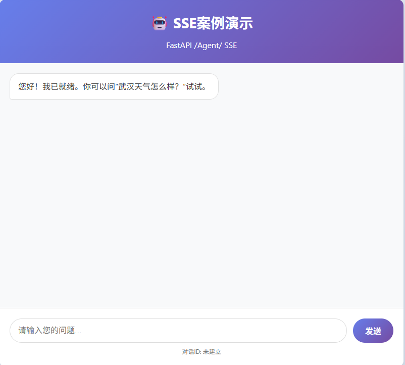

# ITS 智能客服系统 - 接入多Agent框架

**主题**: 零基础入门 OpenAI Agents SDK：Models / Tools / Agents

**时长**: 2天  

**讲师**：胡中奎

**版本**：v1.0 


## 1、课前准备

### 1.1 搭建项目目录结构

```reStructuredText
openai-agents-tutorial/
├── 00_environment/   
├── 01_models/          # 包含与模型相关的代码和示例，比如如何使用OpenAI的不同模型 
├── 02_tools/			# 包含工具的使用示例，OpenAI Agents可以使用工具来执行任务	
├── 03_agents/			# 包含代理（Agents）的示例，展示如何创建和使用代理
├── 04_output_items/    # 包含输出项示例 
├── 05_stream_events/   # 包含流式事件的示例
├── 06_ncp&multi_agent/ # 包含mcp和多代理（Multi-Agent）的示例
├── 07_projects/        # SSE结合FastAPI案例        
│   └── .env/           # 环境变量
```


### 1.2 准备环境

- Python 3.10+ / 虚拟环境
- 安装：`pip install openai-agents`
- 配置：`OPENAI_API_KEY=...


## 2、任务目标

### 2.1 理论知识
1.认识 Agents SDK 的 6 个核心名词（Agent / Runner / Model /Conversation / Tool / Events）  

2.理解“多 Agent 协作”的两种方式：handoff 与 agent-as-tool  

3.理解流式输出：从 SDK events 到 FastAPI SSE


### 2.2 动手实战
1) 创建 1 个 Agent + 1 个 Tool 并跑通 
2) 创建 2 个 Agent（分工）+ 1 个 Triage（路由）并跑通 
3) 接入 一个 后端 `/api/query/sse`（SSE）


## 3、核心架构以及组件讲解

OpenAI内部逻辑比较复杂，但是总体来说是基于这三层架构模型。

```markdown
┌────────────────────────────────────────────┐
│ Capability Plane（能力层）                 │
│                                            │
│  - Tools (Web / File / Code Interpreter)   │
│  - Agents (handoff / tool routing)         │
│                                            │
└────────────────────────────────────────────┘
┌────────────────────────────────────────────┐
│ Execution Plane（执行层）                  │
│                                            │
│  - Run                                     │
│  - Conversation                            │
│  - Streaming / Background / Parallelism    │
│                                            │
└────────────────────────────────────────────┘
┌────────────────────────────────────────────┐
│ Model Plane（模型层）                      │
│                                            │
│  - GPT / Gemini / Qwen / Claude            │
│                                            │
└────────────────────────────────────────────┘


```

**架构说明：**

1.  **模型层**：提供基础大模型能力。
2.  **能力层**：在模型之上构建的核心功能模块。
3.  **执行层**：管理单个会话运行时的状态、输出与事件流


### 3.1、Model Plane（模型层）  

#### 1、什么是model

**模型**是经过大量数据训练的人工智能系统，能够理解和生成自然语言。就像人类大脑，模型通过学习获得了知识和推理能力。也即你熟悉的 `gpt-4o`、`deepseek` 等大模型。

**类比理解**：模型就像一位博览群书的学者，学习了海量知识，能够回答各种问题。


#### 2、为什么要用model

**1.理解能力**：将自然语言转换为结构化理解

**2.推理能力**：进行逻辑推理和问题解决

**3.生成能力**：根据理解生成自然语言回复


#### 3、如何使用model

根据官网，使用模型有两种方式分别是传统的 **Chat Completions API**和新的 **Responses API** 

官网地址:https://github.com/openai/openai-python


传统 **Chat Completions API**使用

```python
from openai import OpenAI
from  dotenv import load_dotenv
import os

# 加载环境变量
load_dotenv()

# 创建客户端 - 需要传入api_key和base_url
client = OpenAI(
    api_key=os.getenv("OPENAI_API_KEY"),
    base_url=os.getenv("OPENAI_BASE_URL"),
)

# API调用（创建响应）
response = client.chat.completions.create(
    model=os.getenv("OPENAI_MODEL_NAME"),
    messages=[
        {"role": "system", "content": "你是一个专业的Python开发人员"},
        {
            "role": "user",
            "content": "如何检查Python对象是否是类的实例？",
        },
    ],
)

print(response.choices[0].message.content)
```


新的**Responses API** 使用

```python
from openai import OpenAI
from  dotenv import load_dotenv
import os

# 加载环境变量
load_dotenv()

# 创建客户端 - 需要传入api_key和base_url
client = OpenAI(
    api_key=os.getenv("OPENAI_API_KEY"),
    base_url=os.getenv("OPENAI_BASE_URL"),
)

# API调用（创建响应）
response = client.responses.create(
    model=os.getenv("OPENAI_MODEL_NAME"),
    input="写一个关于独角兽的睡前小故事"
)
print(response.output_text)
```


二者区别：

| 特性维度       | **Chat Completions API (传统)**                              | **Responses API (新范式)**                                   |
| -------------- | ------------------------------------------------------------ | ------------------------------------------------------------ |
| **设计哲学**   | 模拟**多轮对话**，开发者需要精心编排`messages`列表来管理上下文。 | 面向**完成单一任务**，API本身支持多轮推理和调用工具，更接近“智能体”。 |
| **上下文管理** | 你需要手动维护一个包含`user`, `assistant`, `system`角色的消息数组。 | 大部分情况下，你只需提供当前的`input`和系统级的`instructions`，历史由API管理 |
| **输出结构**   | 返回一个包含`choices`的复杂对象，需解析`message`内容，工具调用需检查`tool_calls`。 | 返回结构更扁平，直接通过`.output_text`获取最终回复，工具执行结果已集成在内。 |
| **文件处理**   | 需要将文件内容编码为文本（如图片描述）放入消息。             | 支持直接上传文件（如图片、PDF），模型可直接读取和分析文件内容。 |
| **对话记忆**   | 无内置记忆，每次请求需携带完整历史。                         | **具备会话记忆**，通过`session_id`参数可让模型记住当前会话中的历史。 |
| **工具调用**   | 需在请求中定义`tools`参数，并手动处理模型的工具调用请求和返回结果，流程复杂。 | **原生、自动化程度高**。直接在请求中提供`tools`，模型可自主决定何时、如何调用，并返回最终结果。 |

简单来说，**Chat Completions API 是“对话模式”，而 Responses API 是“任务模式”**。后者专为构建更智能的AI应用（即智能体）而设计。


#### 4、如何更换其它model？

- 支持任何 OpenAI 兼容接口（包括国产模型如 Qwen、DeepSeek）
- 只需修改 `model` 字段 + 配置 `base_url` 和 `api_key`

```python
from openai import OpenAI
from  dotenv import load_dotenv
import os

# 加载环境变量
load_dotenv()

# 创建客户端 - 需要传入api_key和base_url
client = OpenAI(
    # api_key=os.getenv("SF_API_KEY"),
    # base_url=os.getenv("SF_BASE_URL"),
    api_key=os.getenv("AL_BAILIAN_API_KEY"),
    base_url=os.getenv("AL_BAILIAN_BASE_URL"),
)

# API调用（创建响应）
response = client.chat.completions.create(
    # model=os.getenv("SF_MODEL_NAME"),
    model=os.getenv("AL_BAILIAN_MODEL_NAME"),
    messages=[
        {"role": "system", "content": "你是一个乐于助人的助手"},
        {
            "role": "user",
            "content": "你是谁？",
        },
    ],
)

print(response.choices[0].message.content)
```

**注意**，目前` Responses API`是新范式，国内很多模型厂商还没有适配。所以如果选择国内的模型使用` Responses API`会出错。

以阿里云百炼qwen3-max为例：

官网兼容OpeanAI示例说明：https://bailian.console.aliyun.com/?spm=5176.29597918.J_SEsSjsNv72yRuRFS2VknO.2.684c7b08LQ5qqg&tab=model#/model-market/detail/qwen3-max


### 3.2 、Capability Plane（能力层）    

#### 1、 Tools组件

##### 1、什么是Tool

**Tool（工具）**是智能体可以调用的外部函数，让AI能够执行特定任务，如查询天气、搜索信息、计算数据等。

**关键特征**：

- 有明确的输入参数
- 执行具体功能
- 返回结构化结果
- 可以被多个智能体复用


##### 2、为什么要用Tool

1. **扩展能力**：弥补AI的局限性
2. **获取实时数据**：访问最新信息
3. **执行操作**：调用外部系统API
4. **确保准确性**：减少AI幻觉
5. **标准化流程**：统一业务逻辑


##### 3、如何使用Tool

使用**Responses API** 携带工具

```python
from openai import OpenAI
from  dotenv import load_dotenv
import os

# 加载环境变量
load_dotenv()

# 创建客户端 - 需要传入api_key和base_url
client = OpenAI(
    api_key=os.getenv("OPENAI_API_KEY"),
    base_url=os.getenv("OPENAI_BASE_URL"),
)

# API调用（创建响应）
response = client.responses.create(
    model=os.getenv("OPENAI_MODEL_NAME"),
    tools=[{"type": "web_search"}],
    input="今天有什么积极的新闻吗?"
)
print(response.output_text)
```

这里注意，传统 **Chat Completions API使用不能这样使用**。它的type必须是funcation `“type": "funcation"`不能是工具的名字。

官网链接：https://platform.openai.com/docs/guides/tools?tool-type=function-calling


##### 4、Tool使用场景

| 场景     | 工具示例                              | 说明           |
| :------- | :------------------------------------ | :------------- |
| 数据查询 | `search_product`, `query_order`       | 查询数据库信息 |
| 计算服务 | `calculate_price`, `convert_currency` | 执行数学计算   |
| 外部API  | `send_email`, `create_ticket`         | 调用第三方服务 |
| 文件操作 | `read_file`, `generate_report`        | 处理文档数据   |


#### 2、Agents组件

##### 1、什么是Agent

**Agent（智能体）**是具有特定目标和能力的AI助手，可以：

- 理解用户意图
- 规划任务步骤
- 调用工具执行
- 做出决策
- 与其他智能体协作


##### 2、为什么要用Agent

传统的大模型就像一位聪明的顾问：它能回答问题、给出建议，但**不会自己动手做事**。而Agent是让AI真正"动起来"的组件，**让AI成为"执行者"，而不仅仅是"建议者"**，从而突破大模型的三大局限知识时效性、操作能力和数据访问限制。同时Agent能分解复杂任务、管理多轮对话、记忆历史交互，实现从单次问答到持续协作。


##### 3、如何使用Agent

在 OpenAI Agents SDK 中，使用一个 Agent 并让它真正“动起来”，需要完成两个核心动作：

1. **配置模型客户端**（告诉 Agent 用哪个大模型）
2. **运行 Agent 并获取结果**

>  特别注意：
>  如果你使用的是 **OpenAI 官方 API**，可以直接用 `model="gpt-4o"`；
>  但如果你使用的是 **代理节点**（如阿里通义、智谱、DeepSeek 等兼容 OpenAI 接口的模型），**必须先手动创建模型客户端**！
>
> 官网链接：https://github.com/openai/openai-agents-python


下面我们将从**最通用的场景出发**——使用国内兼容 OpenAI 的模型（如通义千问 Qwen）——来讲解三种主流的 Agent 使用方式。

 **为什么需要“实例化客户端”？**

传统大模型调用：

```
response = openai.chat.completions.create(model="gpt-4o", ...)
```

但在多 Agent 系统中，Agent 需要**自主决定何时调用模型、调用多少次**。因此 SDK 要求你提前提供一个**可复用的模型客户端对象**（`AsyncOpenAI`），而不是每次临时拼参数。

 所有非官方 OpenAI 模型（包括通过代理访问的 gpt-4o）都必须这样做！

官网链接：https://openai.github.io/openai-agents-python/models/


######  1. 三种方式配置模型客户端

（按作用范围排序）

| 方式                                            | 作用范围                    | 适用场景                  |
| ----------------------------------------------- | --------------------------- | ------------------------- |
| **方式一`set_default_openai_client`：全局设置** | 所有 Agent 共享同一个客户端 | 快速原型、单模型项目      |
| **方式二`ModelProvider`：运行时传入**           | 单次 Run 指定客户端         | 多模型混合调度            |
| **方式三`Agent.model`：绑定到单个 Agent**       | 仅该 Agent 使用指定客户端   | 精细控制每个 Agent 的模型 |


 方式一：全局设置

> 适用于整个项目只用一种模型的情况（如全部用 Qwen-Plus）

```python
import asyncio
import os

from openai import AsyncOpenAI

from agents import (
    Agent,
    Runner,
    set_default_openai_api,
    set_default_openai_client,
    set_tracing_disabled,
)

BASE_URL ="https://dashscope.aliyuncs.com/compatible-mode/v1"
API_KEY = "sk-26d57c968c364e7bb14f1fc350d4bff0"
MODEL_NAME = "qwen-plus"

# 1. 创建异步客户端（必须是 AsyncOpenAI！）
client = AsyncOpenAI(
    base_url=BASE_URL,
    api_key=API_KEY
)
# 2. 全局注册客户端（所有 Agent 都会用它）
set_default_openai_client(client=client)   
set_default_openai_api("chat_completions")   # 必须指定为 chat_completions
set_tracing_disabled(disabled=True)  # 避免因 tracing 导致 401 错误


async def main():
    # 3. 创建 Agent（只需指定 model 名称）
    agent = Agent(
        name="Assistant", # Agent的名字
        instructions="你只会用七言绝句回应", # 给Agent的指令
        model=MODEL_NAME,  # 这里只是字符串
    )
    # 3.运行Aagent
    result = await Runner.run(agent, "给我写一首关于春天的七言绝句") # 运行Agent
    
    # 4.得到Agent结果
    print(result.final_output)  # 得到Agent结果

if __name__ == "__main__":
    asyncio.run(main())

```

> 注意事项：
>
> - 必须调用 `set_default_openai_api("chat_completions")`，否则报 400
> - 必须调用 `set_tracing_disabled(True)`，否则可能因 tracing 服务不可用报 401
> - 客户端必须是 `AsyncOpenAI`（即使你后面用同步调用）


方式二：运行时传入（灵活调度多模型）

> 适用于一次请求中动态切换模型，或测试不同模型效果

```python
from __future__ import annotations

import asyncio

from openai import AsyncOpenAI

from agents import (
    Agent,
    Model,
    ModelProvider,
    OpenAIChatCompletionsModel,
    RunConfig,
    Runner,
    function_tool,
    set_tracing_disabled,
)

BASE_URL =  "https://dashscope.aliyuncs.com/compatible-mode/v1"
API_KEY =  "sk-26d57c968c364e7bb14f1fc350d4bff0"
MODEL_NAME =  "qwen-plus"

client = AsyncOpenAI(base_url=BASE_URL, api_key=API_KEY)
set_tracing_disabled(disabled=True)

# 1. 自定义ModelProvider类，实现ModelProvider接口的get_model方法
class CustomModelProvider(ModelProvider):

     # 实现ModelProvider接口的get_model方法
    def get_model(self, model_name: str) -> Model:

        return OpenAIChatCompletionsModel(model= model_name, openai_client=client) # 直接返回OpenAIChatCompletionsModel  不用在调用set_default_openai_api("chat_completions")设置默认api为chat_completions


# 2. 创建CustomModelProvider实例
CUSTOM_MODEL_PROVIDER = CustomModelProvider()

async def main():
    # 3. 使用CustomModelProvider实例创建Agent
    agent = Agent(name="Assistant", instructions="你只会用七言绝句回应.",model=MODEL_NAME) # 字符串，由 provider 解析

    # 4. 运行Agent
    result = await Runner.run(
        agent,
        input="给我写一首关于春天的七言绝句",
        run_config=RunConfig(model_provider=CUSTOM_MODEL_PROVIDER), # 在 run 时传入自定义 provider

    )
    # 5. 获取Agent运行结果
    print(result.final_output)

if __name__ == "__main__":
    asyncio.run(main())
```

> 优点：无需全局污染，每个 Run 可独立配置模型来源


方式三：绑定到单个 Agent（最精细控制）

> 适用于不同 Agent 使用不同模型（如客服用 Qwen，分析用 DeepSeek）

```python
import asyncio


from openai import AsyncOpenAI

from agents import Agent, OpenAIChatCompletionsModel, Runner, function_tool, set_tracing_disabled

BASE_URL = "https://dashscope.aliyuncs.com/compatible-mode/v1"
API_KEY =  "sk-26d57c968c364e7bb14f1fc350d4bff0"
MODEL_NAME = "qwen-plus"

# 1. 创建AsyncOpenAI客户端实例
client = AsyncOpenAI(base_url=BASE_URL, api_key=API_KEY)
set_tracing_disabled(disabled=True)

async def main():
    # 2. 创建Agent实例
    agent = Agent(
        name="Assistant",
        instructions="你只会用七言绝句回应.",
        model=OpenAIChatCompletionsModel(model=MODEL_NAME, openai_client=client), # 3.直接传入模型对象（不再是字符串！）OpenAIChatCompletionsModel
    )

    # 4. 运行Agent
    result = await Runner.run(agent, "给我写一首关于春天的七言绝句")

    # 5. 获取Agent运行结果
    print(result.final_output)


if __name__ == "__main__":
    asyncio.run(main())
```

> 优点：Agent 自包含，不依赖外部配置


###### 2. 三种调用方式

无论用哪种模型配置方式，Agent 都支持以下三种调用模式：

官网链接：https://openai.github.io/openai-agents-python/running_agents/

| 调用方式     | 方法                    | 返回类型             | 适用场景           |
| ------------ | ----------------------- | -------------------- | ------------------ |
| **同步调用** | `Runner.run_sync()`     | `RunResult`          | 脚本、简单后端     |
| **异步调用** | `await Runner.run()`    | `RunResult`          | FastAPI、高并发    |
| **流式调用** | `Runner.run_streamed()` | `RunResultStreaming` | 实时对话、SSE 接口 |

示例：同步调用（最简单）

```python
result = Runner.run_sync(agent, "问题")
print(result.final_output)
```

示例：异步调用（推荐 Web 后端）

```python
result = await Runner.run(agent, "问题")
```

示例：流式调用（实现“打字机效果”）

```python
streaming_result = Runner.run_streamed(agent, "问题")

async for event in streaming_result.stream_events():
    if event.type == "raw_response_event":
        delta = event.data.delta  # 增量文本
        print(delta, end="", flush=True)

# 最终完整结果仍可通过 final_output 获取
print("\n完整答案：", streaming_result.final_output)
```

>  流式事件类型说明（）：
>
> - `"tool_call"`：Agent 准备调用工具
> - `"tool_output"`：工具返回结果
> - `"raw_response_event"`：模型生成的文本增量（含思考过程）
> - `"final_answer"`：最终回答完成


###### 3.tool集成Agent

```python
import asyncio


from openai import AsyncOpenAI

from agents import Agent, OpenAIChatCompletionsModel, Runner, function_tool, set_tracing_disabled

BASE_URL = "https://dashscope.aliyuncs.com/compatible-mode/v1"
API_KEY =  "sk-26d57c968c364e7bb14f1fc350d4bff0"
MODEL_NAME = "qwen-plus"

client = AsyncOpenAI(base_url=BASE_URL, api_key=API_KEY)
set_tracing_disabled(disabled=True)


@function_tool
def get_weather(city: str) -> str:
    """获取指定城市的天气信息"""
    return f"天气信息: {city} 是晴天"

async def main():
    agent = Agent(
        name="天气助手",
        instructions="你是一个天气助手，你只能回答关于天气的问题。",
        model=OpenAIChatCompletionsModel(model=MODEL_NAME, openai_client=client),
        tools=[get_weather],

    )
    result = await Runner.run(agent, "武汉的天气")
    print(result.final_output)


if __name__ == "__main__":
    asyncio.run(main())
```

> 注意事项：
>
> - 函数上使用@function_tool注解
> - tools必须是列表


###### 4.Agent输出结构化对象

```python
import asyncio
import json
from openai import AsyncOpenAI
from agents import Agent, OpenAIChatCompletionsModel, Runner, function_tool, set_tracing_disabled
from pydantic import BaseModel

BASE_URL = "https://dashscope.aliyuncs.com/compatible-mode/v1"
API_KEY =  "sk-26d57c968c364e7bb14f1fc350d4bff0"
MODEL_NAME = "qwen-plus"

client = AsyncOpenAI(base_url=BASE_URL, api_key=API_KEY)
set_tracing_disabled(disabled=True)

class WeatherResult(BaseModel):
    city: str
    condition: str
    source: str
    message: str

@function_tool
def get_weather(city: str) -> str:
    return json.dumps(
        {"city": city, "condition": "晴", "source": "tool", "message": f"{city}天气晴朗"},
        ensure_ascii=False,
    )

async def main():
    agent = Agent(
        name="天气助手",
        instructions=(
            "你是天气助手，只回答天气问题。"
            "当用户问天气时必须调用 get_weather。"
        ),
        model=OpenAIChatCompletionsModel(model=MODEL_NAME, openai_client=client),
        tools=[get_weather],
        output_type=WeatherResult,
    )

    result = await Runner.run(agent, "武汉的天气")
    # result.final_output 不再是 str，而是 WeatherResult（或可当作 dict 使用）
    print("final_output:", result.final_output)

    # 如果你想转 dict

    print("as dict:", result.final_output.model_dump())

asyncio.run(main())

```


##### 4、Agent使用场景

| 场景     | Agent类型 | 职责                   |
| :------- | :-------- | :--------------------- |
| 客服系统 | 客服专员  | 解答常见问题           |
| 技术支持 | 技术专家  | 解决技术问题           |
| 销售咨询 | 销售顾问  | 产品推荐和报价         |
| 订单处理 | 订单专员  | 处理订单相关事务       |
| 路由分发 | 路由助手  | 将问题分发给合适的专家 |


### 3.3 、Execution Plane（执行层）  

Run是一次执行的生命周期，里面包含各个核心状态结构、例如历史消息（Conversation）、Tool 调用状态、Streaming 状态、Handoff / Agent 路由轨迹

Background / 并发状态等。这里面我们以两个核心状态为例。Streaming 状态、历史消息（Conversation）

以下是一个执行层架构示意图：

```markdown


┌──────────────────────────────────────────────┐
│ Execution Plane（执行层 / Run Lifecycle）    │
│                                              │
│  ┌────────────────────────────────────────┐ │
│  │ Run                                    │ │
│  │                                        │ │
│  │  Conversation State                    │ │
│  │  ------------------------------------  │ │
│  │  • message history                     │ │
│  │  • tool call state                     │ │
│  │  • agent routing state                 │ │
│  │                                        │ │
│  │  Output Items                          │ │
│  │  ------------------------------------  │ │
│  │  • ResponseTextItem                    │ │
│  │  • ResponseReasoningItem               │ │
│  │  • ToolCallItem                        │ │
│  │  • ToolCallOutputItem                  │ │
│  │  • HandoffOutputItem                   │ │
│  │                                        │ │
│  │  Event Stream                          │ │
│  │  ------------------------------------  │ │
│  │  • ResponseTextDeltaEvent              │ │
│  │  • ResponseReasoningSummaryTextDelta   │ │
│  │  • run_item_stream_event               │ │
│  │  • agent_updated_stream_event          │ │
│  │                                        │ │
│  └────────────────────────────────────────┘ │
└──────────────────────────────────────────────┘
```


#### 1、流式（Streaming） 

##### 1、什么是Streaming 

**Streaming（流式）**是实时逐字或逐段输出内容的技术，而不是等待全部生成完成再一次性返回。

**类比理解**：就像看直播和看录播的区别

- 流式：实时直播，边生成边观看
- 非流式：录制完成，一次性观看


##### 2、为什么要用Streaming 

1. **提升用户体验**：减少等待时间，立即看到响应
2. **显示处理进度**：用户知道系统正在工作
3. **节省内存**：不需要缓存完整响应
4. **实时交互**：可以中途打断或调整


##### 3、如何使用Streaming 	

**核心代码骨架：**

```python
result = Runner.run_streamed(agent, "问题")

async for event in result.stream_events():
```


##### 4、Streaming 使用场景

| 场景     | 使用方式 | 优势           |
| :------- | :------- | :------------- |
| 聊天对话 | 逐字输出 | 自然对话体验   |
| 长文生成 | 分段输出 | 避免长时间等待 |
| 代码生成 | 实时显示 | 即时调试和修改 |
| 实时翻译 | 流式翻译 | 减少延迟       |
| 语音合成 | 流式音频 | 实时播放       |


#### 2、输出项（Output Items）

##### 1、什么是Output Items

输出项是Run 在执行过程中产生的**结构化事实对象**”，注意它：

- 不是模型输出本身
- 不是 Agent 的决策逻辑
- 不是 Tool 的执行逻辑

而是Run 对“执行过程”的结构化记录。

例如：

| 类型               | 含义                   |
| ------------------ | ---------------------- |
| ResponseOutputItem | 模型生成了文本         |
| ToolCallItem       | Agent 决定调用某个工具 |
| ToolCallOutputItem | 工具执行完成           |
| HandoffOutputItem  | Agent 发生了交接       |

> Output Items = Run 内部发生的每一个“事件事实”的不可变快照。


##### 2、为什么要用Output Items

如果你只有 `final_output`，你会失去对 Agent **内部决策过程的全部洞察**。具体来说：

| 你想知道                                   | 没有 Output Items 的世界 |
| ------------------------------------------ | ------------------------ |
| Agent 有没有调用工具？                     | 不知道                   |
| 调用过哪些工具？                           | 不知道                   |
| 每次调用参数是什么？                       | 不知道                   |
| 为什么给出这个答案？                       | 不知道                   |
| 是模型直接回答，还是基于工具结果推理得出？ | 不知道                   |
| 整个任务被分解成了哪几步？每一步如何推理？ | 不知道                   |

而 **Output Items 正是 Agent 执行过程的“黑匣子记录仪”** —— 它以结构化的方式保存了每一步思考（Thought）、每一次行动（Action）、每一个观察（Observation），让你不仅能拿到答案，还能**理解答案是如何产生的**，从而实现调试、审计、和可信 AI。

> Output Items 解决的是：让 Agent 的“黑箱”变成“白盒执行流水线”


##### 3、如何使用Output Items

**核心代码骨架：**

```python
result = await Runner.run(agent, "武汉的天气")

for item in result.new_items:
    print(type(item), item.raw_item)

```

你会看到

```scss
ToolCallItem(...)
ToolCallOutputItem(...)
ResponseOutputItem(...)

```

**完整代码**

```python
import asyncio
from openai import AsyncOpenAI
from agents import Agent, OpenAIChatCompletionsModel, Runner, function_tool, set_tracing_disabled

BASE_URL = "https://dashscope.aliyuncs.com/compatible-mode/v1"
API_KEY =  "sk-26d57c968c364e7bb14f1fc350d4bff0"
MODEL_NAME = "qwen-plus"

client = AsyncOpenAI(base_url=BASE_URL, api_key=API_KEY)
set_tracing_disabled(disabled=True)


@function_tool
def get_weather(city: str) -> str:
    """获取指定城市的天气信息"""
    return f"天气信息: {city} 是晴天"

async def main():
    agent = Agent(
        name="天气助手",
        instructions="你是一个天气助手，你只能回答关于天气的问题。",
        model=OpenAIChatCompletionsModel(model=MODEL_NAME, openai_client=client),
        tools=[get_weather],

    )
    result = await Runner.run(agent, "武汉的天气")

    for item in result.new_items:
        print(f"Agent运行期间输出项类型: {type(item)}, 输出项对象: {item.raw_item}")

    print(f"Agent最终输出: {result.final_output}")


if __name__ == "__main__":
    asyncio.run(main())
```

观测Agent执行过程：

```sql
User
 ↓
Agent 思考
 ↓
ToolCallItem        ← 记录“决定调用工具”
 ↓
ToolCallOutputItem  ← 记录“工具返回”
 ↓
MessageOutputItem  ← 记录“模型输出”
```


##### 4、Output Items使用场景

官网链接：https://openai.github.io/openai-agents-python/ref/items/


**Agents SDK 最常用 Output Items五剑客**

Output Items 是 **Run 的执行事实记录**，不是模型回复，而是对 Agent 行为的结构化审计日志。

| 分类     | 类型名称   | 类名                                      | 业务含义                                                     |
| -------- | ---------- | ----------------------------------------- | ------------------------------------------------------------ |
| 会话输出 | 模型消息   | `MessageOutputItem`                       | **最终对话内容**，承载 `role=assistant/user/system`，是 Conversation Plane 的唯一出口 |
| 决策行为 | 工具调用   | `ToolCallItem`                            | Agent 决定调用某个工具（函数名 + 参数 JSON）                 |
| 行为结果 | 工具返回   | `ToolCallOutputItem`                      | 工具执行后的真实返回值                                       |
| 流程控制 | Agent 交接 | `HandoffOutputItem`                       | 当前 Agent 主动切换控制权给其他 Agent                        |
| 执行推理 | 推理摘要   | `ReasoningItem` / `ResponseReasoningItem` | 模型在每一步决策前后的**执行级思考记录**（Execution Plane 专用） |

> Agent 不是直接“说话”，而是在执行。
>  MessageOutputItem 是执行世界翻译成对话世界的唯一出口。


**Agents SDK 最容易混淆的Output Items**

第一组：MessageOutputItem / ResponseOutputItem / ResponseOutputMessage/ResponseOutputText

第二组：ReasoningItem / ResponseReasoningItem


**1、先记住三条铁律**

| 层                 | Plane          | 你现在看到的                    |
| ------------------ | -------------- | ------------------------------- |
| Conversation Plane | 模型说了什么   | `final_output` / assistant 消息 |
| Execution Plane    | Run 发生了什么 | Output Items / Event Stream     |
| Transport Plane    | 厂商协议       | ResponseXXX / OpenAI SDK        |


**2、解释说明**

**2.1 MessageOutputItem**（Execution Plane 标准接口）

表示：**Run 产生了一条“对话消息”这个事实**


**2.2 ResponseOutputMessage**（Transport Plane 具体实现）

这是OpenAI `responses.create()` API 的原生输出结构，SDK 做了适配：ResponseOutputMessage  ⟶  MessageOutputItem

所以：

| SDK 对外类型      | 实际实例              |
| ----------------- | --------------------- |
| MessageOutputItem | ResponseOutputMessage |


 **2.3 ResponseOutputItem**又是什么？（Transport Plane 具体实现）

这是一个**厂商响应协议的父类**：它不是“消息”，而是：OpenAI Responses API 所有输出项的基础类，包括

| 子类                       |
| -------------------------- |
| ResponseOutputMessage      |
| ResponseReasoningItem      |
| ResponseFunctionToolCall   |
| ResponseFunctionToolOutput |


**三者关系**：

> ResponseOutputItem  (协议基类)
>     ├── ResponseOutputMessage（SDK实际输出项类型）  ───▶ MessageOutputItem（对外）
>     ├── ResponseReasoningItem（SDK实际输出项类型） ───▶ ReasoningItem（对外）
>     └── ResponseFunctionToolCall（SDK实际输出项类型）─▶ ToolCallItem（对外）


2.4 **ResponseOutputText又是什么？**

它是模型一条消息内部的最小“文本分片单元”模型一句话的原子粒子。为什么要拆成 ResponseOutputText？这是为了支持

多模态：同一条消息可混合 text / image / audio

流式推送：每个 token 以 `ResponseTextDeltaEvent` 增量推送


**2.5 ReasoningItem**（Execution Plane  标准接口）

表示：**Run 过程中模型发生了一次推理行为**这个事实，不属于对话内容。


**2.6 ResponseReasoningItem**（Transport Plane 具体实现）

这是 OpenAI Responses API 的的原生输出结构{ "type": "reasoning", "summary": [...] }，SDK 做了适配：ResponseReasoningItem⟶  ReasoningItem


**3.一句话杀死**

**ResponseXXX 是厂商协议，XXXOutputItem 是 Agent 执行事实。**


思考：为什么 final_output 只有 MessageOutputItem？

> final_output 是 **Conversation Plane 的投影结果**，不是 Execution Plane 的日志。


#### 3、事件流（Stream Event ）

现在我们知道：Run 会产生 Output Items —— 但它们是**执行完后才一次性给你的**。

##### 1、什么是Stream Event 

Stream Event 是：Run 在执行过程中，**把每一个 Output Item 变成实时事件发出来**，不是结果，是**过程直播**。

从本质看，事件流是 Run 对自身执行过程的“实时可观测接口（Observability API）”它是Execution Plane 的实时遥测系统（telemetry bus）,换句话说是Run 在执行时，实时“播报”Output Items 的方式。


##### 2、为什么要用Stream Event 

| 业务诉求         | 没有 Event Stream |
| ---------------- | ----------------- |
| 实时进度条       | 做不了            |
| Agent 多阶段提示 | 做不了            |
| Tool 执行状态 UI | 做不了            |


##### 3、如何使用Stream Event 

从官网看Agents SDK 的 `stream_events()` 返回的 `StreamEvent` 其实只有 **三类事件**

官网链接：https://openai.github.io/openai-agents-python/ref/stream_events/#agents.stream_events.RawResponsesStreamEvent

**1.RawResponsesStreamEvent**（`type="raw_response_event"`）

**2.RunItemStreamEvent**（`type="run_item_stream_event"`）

**3.AgentUpdatedStreamEvent**（`type="agent_updated_stream_event"`） 

虽然说是三种，本质就是：**用哪一类事件来驱动你的业务 UI/日志/调试**

> 注意：**RawResponsesStreamEvent / RunItemStreamEvent / AgentUpdatedStreamEvent
>  只在 `run_streamed()` 模式下产生。**
>  普通 `run()` / `run_async()` 永远拿不到这些事件。
>
> 因为 `run` / `run_async`，因为它们的语义是：“我不关心你中间怎么做，只给我最终结果。”，所有中间过程，都会被**直接吞掉**，不会对外广播。
>
> 而`run_streamed()` 的语义是：“我需要你**边执行边汇报执行过程**。”

记住：`run()` 是结果 API，`run_streamed()` 是执行遥测 API


###### 1.RawResponsesStreamEvent

`RawResponsesStreamEvent` 是“直接从 LLM 透传出来的 raw streaming event”，属于**模型底层流式事件的总包装器**，主要是用来拿“模型原始增量",非常适合做“打字机效果”/实时输出，关心的是 **模型流式 token**，不关心工具/交接的细节，而真正有用的是它里面的 `event.data` 的类型。

最常用的两个具体实现类原始推理增量类`ResponseReasoningDeltaEvent`、原始文本增量类`ResponseTextDeltaEvent`


`ResponseReasoningDeltaEvent`是模型在“思考阶段”实时吐出的 reasoning 片段，本质上不是给用户看的内容，是模型内部 Chain-of-Thought 的增量片段，而SDK 会把它们汇总成最终的 `ResponseReasoningItem`

**核心代码骨架：**

```python
if isinstance(event.data, ResponseReasoningDeltaEvent):
    print("推理中:", event.data.delta)
```


`ResponseTextDeltaEvent`是模型正在给用户“吐字”的每一个文本分片，就是我们熟悉的流式输出内容，而SDK最终会合成为 `MessageOutputItem → ResponseOutputMessage`。

**核心代码骨架：**

```python
if isinstance(event.data, ResponseTextDeltaEvent):
    print("输出:", event.data.delta, end="")
```


###### 2.RunItemStreamEvent

`RunItemStreamEvent是`**“Run 新增了一个 OutputItem”时的事件**,它不是Token,本质上**Execution Plane 的结构化状态节点广播器**，相反非常关心工具/交接的细节，不关心**模型流式 token**。

最常用的两个具体实现类工具被调用（ToolCallItem）工具执行完成（ToolCallOutputItem）


`ToolCallItem` 表示Agent 已经决定 我要调用某个工具了（函数名 + 参数已确定）。事件名：tool_called，对应 Output Item 类ToolCallItem

```python
if event.type == "run_item_stream_event" and event.name == "tool_called":
    tool_call_item = event.item.raw_item
    print("调用工具:", tool_call_item.name, tool_call_item.arguments)

```


`ToolCallOutputItem` 表示Agent 已经调用完工具了，工具已经跑完，工具结果回来了。事件名：tool_output，对应 Output Item 类ToolCallOutputItem

```python
if event.type == "run_item_stream_event" and event.name == "tool_output":
    output_item = event.item
    print("工具结果:", output_item.output)

```


###### 3.AgentUpdatedStreamEvent

`AgentUpdatedStreamEvent`是指“现在有一个新的 agent 在运行，适合多 Agent 场景下做 UI：显示“当前正在由哪个 agent 处理”，或者想在日志里标记：**从 orchestrator → 某个子 agent 的运行切换**，字段是 `new_agent`


**核心代码骨架：**

```python
async for event in result.stream_events():
    if event.type == "agent_updated_stream_event":
        print("当前Agent:", event.new_agent.name)

```


###### 4.三者结合使用

```python
import asyncio

from openai import AsyncOpenAI
from openai.types.responses import ResponseTextDeltaEvent, ResponseReasoningSummaryTextDeltaEvent

from agents import (
    Agent,
    OpenAIChatCompletionsModel,
    Runner,
    function_tool,
    set_tracing_disabled,
    ModelSettings,
)

from agents.items import ToolCallItem, ToolCallOutputItem, MessageOutputItem, ReasoningItem, HandoffOutputItem


#（分别演示）
# BASE_URL = "https://api.siliconflow.cn/v1"
# API_KEY =  "sk-vnxijjgodhcjisacoilnebjzzlqmrwyuluqdxcpwauocgqjm"
# MODEL_NAME = "Qwen/Qwen3-32B"

BASE_URL = "https://dashscope.aliyuncs.com/compatible-mode/v1"
API_KEY =  "sk-26d57c968c364e7bb14f1fc350d4bff0"
MODEL_NAME = "qwen3-max"

client = AsyncOpenAI(base_url=BASE_URL, api_key=API_KEY)
set_tracing_disabled(True)


@function_tool
def get_weather(city: str) -> str:
    return f"天气信息: {city} 是晴天"


async def main():
    agent = Agent(
        name="天气助手",
        instructions="你是一个天气助手，用户问天气必须调用 get_weather，禁止编造。",
        model=OpenAIChatCompletionsModel(model=MODEL_NAME, openai_client=client),
        tools=[get_weather],
        # 让模型更倾向一定要走工具
        model_settings=ModelSettings(tool_choice="required"),
    )

    #  关键：使用 run_streamed 才会有三类 StreamEvent
    result = Runner.run_streamed(agent, "武汉的天气怎么样？")

    async for event in result.stream_events():
        # ---------------------------------------------------------------------
        # 1) RawResponsesStreamEvent：模型“原始流”事件（token/片段增量）
        # ---------------------------------------------------------------------
        if event.type == "raw_response_event":
            # 1.1 文本增量（最常见）
            if isinstance(event.data, ResponseTextDeltaEvent):
                print(event.data.delta, end="", flush=True)

            # 1.2 推理摘要增量（部分模型/后端会支持；不支持就不会出现）
            elif isinstance(event.data, ResponseReasoningSummaryTextDeltaEvent):
                # 你也可以选择打印到单独区域
                print("\n[reasoning_summary_delta]", event.data.delta, end="", flush=True)

        # ---------------------------------------------------------------------
        # 2) RunItemStreamEvent：执行过程结构化节点（工具/消息/推理/交接等）
        # ---------------------------------------------------------------------
        elif event.type == "run_item_stream_event":
            name = getattr(event, "name", None)

            # 2.1 工具调用
            if name == "tool_called" and isinstance(event.item, ToolCallItem):
                tool_name = event.item.raw_item.name
                tool_args = event.item.raw_item.arguments
                print(f"\n\n 调用工具: {tool_name} args={tool_args}")

            # 2.2 工具输出
            elif name == "tool_output" and isinstance(event.item, ToolCallOutputItem):
                print(f"\n 工具输出: {event.item.output}")

            # 2.3 生成了一条对话消息（最终给用户看的那种）
            elif name == "message_output_created" and isinstance(event.item, MessageOutputItem):
                # 注意：不同版本的字段可能略有差异，这里给最通用的打印方式
                try:
                    msg = event.item.raw_item
                    print(f"\n message_output_created: role={getattr(msg, 'role', None)}")
                except Exception:
                    print("\n message_output_created")

            # 2.4 生成了一条推理项（Execution Plane 的“事实记录”）
            elif name == "reasoning_item_created" and isinstance(event.item, ReasoningItem):
                try:
                    summary = event.item.raw_item.summary
                    if summary:
                        print("\n reasoning_item_created:", summary[0].text[:200], "...")
                    else:
                        print("\n reasoning_item_created (no summary)")
                except Exception:
                    print("\n reasoning_item_created")

            # 2.5 多 Agent 交接（如果你只有单 Agent，通常不会触发）
            elif name in ("handoff_occured", "handoff_requested") and isinstance(event.item, HandoffOutputItem):
                try:
                    src = event.item.raw_item.source_agent.name
                    tgt = event.item.raw_item.target_agent.name
                    print(f"\n {name}: {src} -> {tgt}")
                except Exception:
                    print(f"\n {name}")

            else:
                # 你想看全量事件名时可打开
                # print("\n[run_item_stream_event]", name, type(event.item))
                pass

        # ---------------------------------------------------------------------
        # 3) AgentUpdatedStreamEvent：当前运行 Agent 更新（多 Agent 编排更明显）
        # ---------------------------------------------------------------------
        elif event.type == "agent_updated_stream_event":
            print(f"\n\n👤 agent_updated_stream_event: {event.new_agent.name}")

    print("\n\nfinal_output:", result.final_output)


if __name__ == "__main__":
    asyncio.run(main())

```


##### 4、 Stream Event使用场景

| 场景             | 用 Stream Event |
| ---------------- | --------------- |
| Web 前端流式输出 | ✔               |
| Agent 工作进度条 | ✔               |
| 实时日志         | ✔               |
| Agent 监控面板   | ✔               |
| 可视化执行流水线 | ✔               |

> 一句话总结：
>
> **RawResponsesStreamEvent** 给你“模型在吐字”；**RunItemStreamEvent** 给你“系统在执行什么”； **AgentUpdatedStreamEvent** 给你“现在是谁在处理”。
>
> 一句话在总结Output Items 是 Run 的“事实记录”，Stream Event 是 Run 的“时间播放”，它们共同构成 Execution Plane 的核心可观测接口。


#### 4、 历史对话（Conversation）

##### 1.什么是Conversation 

在 OpenAI Agents SDK 中：

官网链接：https://openai.github.io/openai-agents-python/sessions/

> **Conversation = 一次 Run 的完整记忆时间线（Memory Timeline）**

它不是一段文本，而是一个**结构化执行日志集合**，内部包含：

| 顺序 | 产生者 | 内容                               |
| ---- | ------ | ---------------------------------- |
| 1    | 用户   | 用户输入问题                       |
| 2    | Agent  | 模型推理（ReasoningItem）          |
| 3    | Agent  | 决定调用工具（ToolCallItem）       |
| 4    | Tool   | 工具执行结果（ToolCallOutputItem） |
| 5    | Agent  | 生成最终回复（MessageOutputItem）  |

它本质是：**Output Items** 的时间有序集合


##### 2.为什么要用Conversation

1. **保持上下文**：记住之前的对话内容
2. **连贯性**：确保回复逻辑一致
3. **分析调试**：便于问题排查和优化

如果没有 Conversation：

- 每一轮都是“失忆 Agent”
- 工具调用、历史输入全部丢失
- 多轮对话无法成立

使用 Conversation 后，Agent 拥有了：

| 能力     | 说明                       |
| -------- | -------------------------- |
| 记忆能力 | 自动携带历史输入           |
| 多轮对话 | Run 自动拼接上下文         |
| 可回溯   | 所有 Tool / 消息都可查询   |
| 可调试   | 支持事后审计、行为回放     |
| 可持久化 | 写入 SQLite / JSON / Redis |


##### 3.如何使用Conversation

OpenAI Agents SDK 通过 **Session 对象** 管理 Conversation。

**1. 核心代码骨架**

```python
from agents import SQLiteSession
session = SQLiteSession("user_001_weather_chat", "conversations.db")
result = Runner.run_streamed(
    agent,
    "武汉的天气怎么样？",
    session=session
)
```

SDK 会自动将"用户输入" "Agent 输出" "工具调用" "工具返回结果"全部写入 `conversations.db`


 **2. Conversation 的自动续写机制**

同一个 `session_id`，Conversation 会自动续写。你**不需要自己拼 history**，SDK 内部已经做了。历史消息 + 新用户输入 → 新一轮推理

```python
result2 = await Runner.run(
    agent,
    "我刚刚问了你什么问题？",
    session=session,
)
```


 **3.如何读取历史对话**

```python
items = await session.get_items()

for it in items:
    print(it)
```

你会看到这些类型的数据：

| type                   | 含义              |
| ---------------------- | ----------------- |
| `message`              | 用户 / Agent 消息 |
| `function_call`        | 工具调用          |
| `function_call_output` | 工具返回结果      |
| `reasoning`            | 推理摘要          |

**也即它是Run 执行全过程的结构化日志仓库**


##### 4.Conversation使用场景

| 场景           | 用 Conversation |
| -------------- | --------------- |
| 多轮聊天       | ✔               |
| Agent 长期记忆 | ✔               |
| 工具链调试     | ✔               |
| 线上日志审计   | ✔               |
| 用户行为分析   | ✔               |


## 4、Agent进阶

本节将深入探讨Agent的高级特性和设计模式，帮助你构建更强大、更灵活的AI应用系统。


### 4.1 Agent集成MCP

#### 1、什么是MCP

**MCP**（Model Context Protocol，模型上下文协议）是一个**标准化的"工具注册与发现协议"**，核心目标是让Agent在运行时从外部MCP Server动态加载工具，而不是将工具硬编码在代码中。

对比传统方式：

| 方式                          | 特点                                            | 问题                                  |
| :---------------------------- | :---------------------------------------------- | :------------------------------------ |
| **传统方式（function_tool）** | 工具必须在代码中注册和定义                      | 代码臃肿，难以维护，更新需要重新部署  |
| **MCP方式**                   | 工具由**外部服务动态提供**，Agent启动时自动发现 | 解耦工具和Agent，支持热更新和动态扩展 |

**核心概念：**

- **MCP Server**：提供工具的外部服务
- **MCP Client**：Agent中连接MCP Server的组件
- **工具动态发现**：Agent运行时自动获取可用工具列表


#### 2、为什么要用MCP

**现实系统面临的挑战：**

1. **工具数量众多**：企业可能有几十甚至上百个工具
2. **工具来源分散**：不同部门提供不同类型的工具
3. **工具频繁变更**：业务需求变化导致工具需要不断更新


**传统方式的问题：**

- 每增加一个工具就要修改Agent代码并重新部署
- Agent与具体业务系统强耦合，难以复用
- 多Agent系统无法共享统一的工具生态
- 权限控制和安全管理变得复杂

**MCP的核心价值：**

- **解耦设计**：将工具从Agent中分离，变成独立的"插件"
- **动态扩展**：新工具上线无需修改Agent代码
- **统一管理**：集中管控工具权限和版本
- **生态共享**：多Agent可以共享同一套工具生态


MCP 的价值就是一句话：**工具从 Agent 中解耦，变成“插件生态”**。


#### 3、Agent如何集成MCP

官网链接：https://openai.github.io/openai-agents-python/mcp/

##### 3.1 基本集成步骤

**步骤1：启动MCP Server**
首先需要一个提供工具的MCP服务器：

```python
# 示例：简单的MCP Server
from agents.mcp import MCPServer
import uvicorn
from fastapi import FastAPI

app = FastAPI()

# 注册工具
@tool
def get_weather(city: str) -> str:
    """获取指定城市的天气"""
    # 实现天气查询逻辑
    return f"{city}的天气是晴天，25℃"

@tool  
def query_order(order_id: str) -> dict:
    """查询订单状态"""
    # 实现订单查询逻辑
    return {"status": "已发货", "tracking": "123456"}

# 创建MCP Server
mcp_server = MCPServer(
    name="企业工具服务",
    description="提供企业内部各种业务工具",
    tools=[get_weather, query_order]
)

# 将MCP Server挂载到FastAPI应用
app.mount("/mcp", mcp_server)

if __name__ == "__main__":
    uvicorn.run(app, host="0.0.0.0", port=3333)
```


**步骤2：Agent通过MCP Client连接**

```python
from agents import Agent
from agents.mcp import MCPClient

# 创建MCP Client连接MCP Server
mcp_client = MCPClient(
    server_url="http://localhost:3333/mcp",
    name="企业工具客户端"
)

# 创建使用MCP工具的Agent
agent = Agent(
    name="企业助手",
    instructions="你可以使用企业系统提供的各种工具来帮助用户解决问题。",
    mcp_servers=[mcp_client]  # 关键：通过mcp_servers参数连接
)

# 运行Agent - 会自动发现并加载MCP Server提供的所有工具
from agents import Runner

result = Runner.run_sync(agent, "帮我查一下订单123456的状态")
print(result.final_output)
```


##### 3.2 通过SSE集成MCP

**1. 概念**：SSE（Server-Sent Events）是一种用于服务器向浏览器推送实时更新的标准技术。它通过 HTTP 协议建立一个单向的持久连接，允许服务器将数据推送到客户端。


**2.为什么要使用SSE来集成MCP？**

在 **Agent 与 MCP 集成** 的场景下，SSE 提供了一种实时流式的方式来接收来自模型的工具调用结果、推理过程、以及最终输出等信息。

- **实时数据流**：SSE 使得后端系统能够实时推送数据到前端，适用于实时应用程序，特别是在需要模型调用外部工具并即时返回结果的场景中。

- **简洁高效**：与 WebSocket 相比，SSE 更加简单，不需要双向通信，仅支持从服务器到客户端的单向流数据，适用于大多数实时数据场景。

- **易于实现**：SSE 通过标准的 HTTP 协议工作，不需要复杂的配置或依赖，因此实现起来较为直接

  

**3.Agent如何使用SSE集成MCP？**

```python
from agents import Agent, Runner
from agents.model_settings import ModelSettings
from agents.mcp import MCPServerSse

async def main():
    workspace_id = "demo-workspace"
    
    # 创建SSE连接的MCP Server
    async with MCPServerSse(
        name="SSE Python Server",
        params={
            "url": "http://localhost:8000/sse",
            "headers": {"X-Workspace": workspace_id},
        },
        cache_tools_list=True,  # 缓存工具列表提升性能
    ) as server:
        
        # 创建使用MCP的Agent
        agent = Agent(
            name="智能助手",
            mcp_servers=[server],
            model_settings=ModelSettings(
                model="gpt-4o",
                tool_choice="required"  # 要求必须使用工具
            ),
            instructions="使用提供的工具回答用户问题。"
        )
        
        # 运行Agent
        result = await Runner.run(
            agent, 
            "东京现在的天气怎么样？"
        )
        print(result.final_output)

# 运行
import asyncio
asyncio.run(main())
```


##### 3.3 多MCP Server集成

一个Agent可以同时连接多个MCP Server：

```python
from agents import Agent
from agents.mcp import MCPClient

# 连接多个MCP Server
weather_mcp = MCPClient(
    server_url="http://weather-service:3333/mcp",
    name="天气服务"
)

order_mcp = MCPClient(
    server_url="http://order-service:3334/mcp", 
    name="订单服务"
)

finance_mcp = MCPClient(
    server_url="http://finance-service:3335/mcp",
    name="财务服务"
)

# 集成多个MCP Server的Agent
super_agent = Agent(
    name="全能助手",
    instructions="你可以使用公司的所有系统工具来解决问题。",
    mcp_servers=[weather_mcp, order_mcp, finance_mcp]
)
```


#### 4、MCP使用场景

| 场景           | 需求                                | MCP解决方案                                 |
| :------------- | :---------------------------------- | :------------------------------------------ |
| **企业级应用** | 集成多个部门系统（CRM、ERP、OA）    | 每个系统提供独立的MCP Server，Agent统一接入 |
| **微服务架构** | 工具分散在不同微服务中              | 每个微服务暴露MCP接口，Agent动态发现        |
| **第三方集成** | 需要接入外部API（天气、支付、地图） | 通过MCP包装第三方API，统一管理              |
| **权限控制**   | 不同用户/角色可用工具不同           | MCP Server根据权限动态返回工具列表          |
| **A/B测试**    | 需要测试不同版本的工具              | MCP Server根据实验分组返回不同工具          |


### 4.2 多Agent 设计模式

#### 1、什么是多Agent

**多Agent系统**是由多个专业化Agent组成的"专家团队"，每个Agent负责特定领域的任务，通过协作完成复杂工作。

**单Agent vs 多Agent对比：**

| 维度       | 单Agent系统            | 多Agent系统                 |
| :--------- | :--------------------- | :-------------------------- |
| **架构**   | 单体式，所有功能集中   | 分布式，功能分散到多个Agent |
| **复杂度** | 指令冗长，逻辑复杂     | 每个Agent职责单一，逻辑清晰 |
| **维护**   | 修改影响整个系统       | 模块化，局部修改不影响其他  |
| **扩展**   | 困难，需要重写大量代码 | 容易，添加新Agent即可       |

多 Agent 架构：一个 Agent 只干一件事，像**微服务**一样协作。

**典型多Agent结构：**

| Agent角色     | 职责                     | 类比     |
| :------------ | :----------------------- | :------- |
| **路由Agent** | 接收请求，分发给合适专家 | 前台接待 |
| **查询Agent** | 处理信息查询类问题       | 信息台   |
| **执行Agent** | 执行具体操作和任务       | 操作员   |
| **审核Agent** | 校验结果和安全性         | 质检员   |
| **报告Agent** | 生成最终输出和报告       | 报告员   |


#### 2、为什么要用多Agent

**单Agent系统的局限性：**

1. **指令过载**：单一Agent需要理解所有领域的知识
2. **性能瓶颈**：复杂任务导致响应时间变长
3. **错误传播**：一个功能出错可能影响整个系统
4. **难以维护**：代码庞大，修改风险高
5. **难以扩展**：添加新功能需要重构整个Agent

**多Agent系统的优势：**

1. **专业分工**：每个Agent专注特定领域，效果更好
2. **并行处理**：多个Agent可以同时工作，提升效率
3. **错误隔离**：一个Agent出错不影响其他Agent
4. **易于维护**：模块化设计，可以独立更新每个Agent
5. **灵活扩展**：需要新功能时添加新Agent即可

**设计原则：**

- **单一职责**：每个Agent只做一件事，并做到最好
- **松耦合**：Agent之间通过标准接口通信
- **可替换**：每个Agent都可以被同类型的其他Agent替换


#### 3、如何使用多Agent

OpenAI Agents SDK支持两种主要的多Agent设计模式：**Manager模式（Agents as Tools）**和**Handoff模式（交接接管）**。


##### 1.中心化(Agents as Tools)

> **Manager**经理模式（中心化）

**概念**：一个"经理Agent"作为总控制器，将其他专业Agent当作"工具"来调用。经理负责所有用户交互和最终决策。


**工作流程：**

1. 用户与经理Agent对话
2. 经理分析需求，决定调用哪个专家Agent
3. 经理调用专家Agent（作为工具）
4. 专家返回结果给经理
5. 经理整合结果，回复用户

**控制权**：始终在经理Agent手中（中心化）


**核心代码骨架：**

```python
from agents import Agent

booking_agent = Agent(...)
refund_agent = Agent(...)

customer_facing_agent = Agent(
    name="Customer-facing agent",
    instructions=(
        "处理所有与用户的直接沟通。"
        "当需要专门知识时，调用相关工具。"
    ),
    tools=[
        booking_agent.as_tool(
            tool_name="订票专家",
            tool_description="处理所有预定请求.",
        ),
        refund_agent.as_tool(
            tool_name="退款专家",
            tool_description="处理所有退款请求.",
        )
    ],
)
```

**Manager模式适用场景：**

- 需要统一话术和品牌形象
- 需要集中权限控制和审计
- 专家输出需要二次加工和美化
- 希望用户感知为单一客服

**优点：**

- 统一的用户体验和话术风格
- 集中控制，易于管理和监控
- 专家Agent可以专注于技术实现
- 可以隐藏系统的复杂性

**缺点：**

- 经理Agent可能成为瓶颈
- 增加了一层调用开销
- 专家输出的细微信息可能丢失


##### 2.去中心化（Handoffs）

**概念**：一个路由Agent分析用户需求，然后将整个对话"交接"给最合适的专家Agent。专家Agent接管后负责后续所有对话。


**工作流程：**

1. 用户与路由Agent对话
2. 路由Agent判断问题类型
3. 路由Agent触发handoff，将会话转移给专家Agent
4. 专家Agent接管，直接与用户对话
5. 专家Agent完成任务或再次handoff给其他专家

**控制权**：在Agent间转移（去中心化）


**核心代码骨架：**

```python
from agents import Agent

booking_agent = Agent(
    name="Booking agent",
    instructions="你负责订票：需要用户提供日期、人数、舱位。"
)

refund_agent = Agent(
    name="Refund agent",
    instructions="你负责退款：需要用户提供订单号、原因，并解释规则。"
)

triage_agent = Agent(
    name="Triage agent",
    instructions=(
        "你负责分流。"
        "如果用户问订票 -> 交接给 booking_agent。"
        "如果用户问退款 -> 交接给 refund_agent。"
    ),
    handoffs=[booking_agent, refund_agent],
)

```


**Handoff模式适用场景：**

- 需要深度专业知识的多轮对话
- 专家需要完整上下文沉浸
- 问题类型明确，可以清晰路由
- 希望模拟真实部门的转接体验

**优点：**

- 专家可以深度处理问题
- 减少中间层，响应更直接
- 每个Agent职责清晰
- 更接近人类协作模式

**缺点：**

- 用户可能感知到"换人"
- 需要处理交接时的上下文传递
- 专家之间的输出风格可能不一致


#### 4、多Agent使用场景

| 场景         | Agent架构                                         | 实现方式                  |
| :----------- | :------------------------------------------------ | :------------------------ |
| **电商客服** | 路由Agent → 售前/售后/物流Agent                   | Handoff模式，模拟部门转接 |
| **数据分析** | 需求分析Agent → SQL生成Agent → 可视化Agent        | Manager模式，流水线处理   |
| **内容创作** | 大纲Agent → 写作Agent → 润色Agent → 审核Agent     | 混合模式，分工协作        |
| **智能家居** | 语音识别Agent → 意图理解Agent → 设备控制Agent     | Handoff模式，实时响应     |
| **企业办公** | 邮件分类Agent → 日程安排Agent → 会议记录Agent     | Manager模式，自动化流程   |
| **教育辅导** | 水平评估Agent → 知识点讲解Agent → 练习题生成Agent | 混合模式，个性化教学      |

**多Agent系统设计最佳实践：**

1. **明确职责边界**：每个Agent应有清晰的输入、处理、输出定义
2. **标准化接口**：Agent之间通过标准化消息格式通信
3. **错误处理**：设计降级策略，当某个Agent失败时如何应对
4. **性能监控**：监控每个Agent的响应时间和成功率
5. **版本管理**：每个Agent应有版本号，支持灰度发布
6. **测试策略**：单元测试每个Agent，集成测试整个工作流

通过合理设计多Agent系统，你可以构建出既能处理简单查询，又能应对复杂任务的可扩展AI应用。


## 5、综合案例实战

### 5.1. 案例实战目标

通过前面学习的基础知识，我们将构建一个交互系统：

1. **后端服务**：FastAPI + Agents SDK
2. **流式通信**：Server-Sent Events (SSE)
3. **前端界面**：实时聊天界面
4. **完整流程**：从用户输入到AI响应的端到端实现


```
┌─────────────┐    HTTP/SSE    ┌─────────────┐    OpenAI API    ┌─────────────┐
│   前端      │───────────────▶│   FastAPI   │─────────────────▶│   Agent     │
│  (浏览器)   │◀───────────────│   后端      │◀─────────────────│   SDK       │
└─────────────┘  实时流式响应   └─────────────┘  异步流式调用    └─────────────┘
```

### 5.2 后端接口设计

#### 5.2.1 接口契约设计

**设计原则：**

1. **简单性**：接口设计要直观易用
2. **实时性**：支持流式响应，提升用户体验

#### 5.2.2 核心接口定义

GET /api/chat/sse（流式聊天接口）


**请求参数：**

```python
query: str             # 用户输入的问题
```


**响应格式：**

- 媒体类型：`text/event-stream`

- 事件类型：`text_delta`、`tool_started`、`tool_completed`、`run_completed`、`error`

  

**事件说明：**

| 事件类型         | 数据格式                                         | 说明                |
| :--------------- | :----------------------------------------------- | :------------------ |
| `text_delta`     | `{"text": "增量文本"}`                           | Agent回复的文本增量 |
| `tool_started`   | `{"tool_name": "工具名", "call_id": "调用ID"}`   | 开始调用工具        |
| `tool_completed` | `{"tool_name": "工具名", "tool_result": "结果"}` | 工具调用完成        |
| `run_completed`  | `{"final_output": "完整回复"}`                   | 运行完成            |
| `error`          | `{"message": "错误信息"}`                        | 发生错误            |


### 5.3 后端实现详解

#### 5.3.1 环境准备与配置

```python
# 1. 安装依赖
# requirements.txt
fastapi
uvicorn
openai-agents
python-dotenv

# 2. 环境配置
# .env 文件
OPENAI_API_KEY=your_api_key_here
OPENAI_BASE_URL=https://api.openai.com/v1
MODEL_NAME=“”
```

#### 5.3.2 关键点解析

**1. StreamingResponse的核心作用**

```python
# StreamingResponse是FastAPI中处理流式响应的关键类
# 它允许我们逐段发送数据，而不是一次性发送所有内容
StreamingResponse(
    generate_sse(),           # 异步生成器，逐段产生数据
    media_type="text/event-stream",  # 指定SSE媒体类型
    headers={...}             # 头信息
)
```

 **2.Agent运行模式的对比**

```python
# 同步运行（一次性获取所有结果）
result = Runner.run_sync(agent, query)
# 返回：RunResult（包含最终输出）

# 异步运行（一次性获取所有结果）
result = await Runner.run(agent, query)
# 返回：RunResult（包含最终输出）

# 流式运行（边执行边获取结果）
result = Runner.run_streamed(agent, query)
# 返回：RunResultStreaming（支持异步迭代事件）
```

**3.SSE事件映射关系**

```python
# Agents SDK的事件类型 -> SSE事件名称
# 这种映射关系是我们自己定义的，不是SDK内置的

# 文本增量事件
ResponseTextDeltaEvent -> "text_delta"

# 工具调用事件
ToolCallItem -> "tool_started"

# 工具结果事件
ToolCallOutputItem -> "tool_completed"

# 运行完成事件
run_completed -> "run_completed"
```


### 5.4 启动步骤

#### 步骤1：准备后端环境

```python
# 1. 进入后端目录
cd backend

# 2. 创建虚拟环境（可选但推荐）
python -m venv venv
source venv/bin/activate  # Linux/Mac
# 或
venv\Scripts\activate     # Windows

# 3. 安装依赖
pip install -r requirements.txt

# 4. 配置环境变量
# 创建 .env 文件，填入你的API密钥
echo "OPENAI_API_KEY=your_api_key_here" > .env
echo "BASE_URL=https://api.siliconflow.cn/v1" >> .env
echo "MODEL_NAME=Qwen/Qwen3-32B" >> .env

# 5. 启动后端服务
python app.py
# 或使用uvicorn直接启动
uvicorn app:app --host 0.0.0.0 --port 8200 --reload
```

#### 步骤2：准备前端环境

```bash
# 1. 进入前端目录
cd frontend

# 2. 由于前端是纯HTML/JS文件，可以直接用浏览器打开
```

#### 步骤3：访问系统

1. 打开浏览器，访问 `http://localhost:8080`（前端）
2. 在前端界面中输入消息
3. 观察前端界面更新

